# Synapsys Simulators — Architecture Design

## Core Idea

Each simulator implements the **full nonlinear dynamics** and exposes a `linearize()` method that returns a `StateSpace` (Synapsys) around any equilibrium point. The user designs the controller on the linear model and tests it on the real nonlinear simulation.

```
                    DESIGN                          REAL SIMULATION
                    ──────                          ───────────────

sim.linearize()  →  StateSpace  →  lqr(A,B,Q,R)  →  K
                        ↓
                   bode(), step()                  sim.step(u, dt)
                   margin(), rlocus()              ← full nonlinear dynamics
                   pole_placement()                ← RK4 integration, no approximation
```

---

## Architecture Diagram

```mermaid
graph TB
    %% ── Styles ──────────────────────────────────────────────────────────
    classDef abstract  fill:#1e293b,stroke:#c8a870,stroke-width:2px,color:#f8fafc
    classDef concrete  fill:#0f172a,stroke:#0d9488,stroke-width:1.5px,color:#f8fafc
    classDef transport fill:#0f172a,stroke:#7c3aed,stroke-width:1.5px,color:#f8fafc
    classDef agent     fill:#0f172a,stroke:#2563eb,stroke-width:1.5px,color:#f8fafc
    classDef viz       fill:#0f172a,stroke:#db2777,stroke-width:1.5px,color:#f8fafc
    classDef synapsys  fill:#0f172a,stroke:#c8a870,stroke-width:1.5px,color:#f8fafc
    classDef gym       fill:#0f172a,stroke:#6b7280,stroke-width:1.5px,color:#9ca3af
    classDef mode      fill:#1e3a2f,stroke:#16a34a,stroke-width:1.5px,color:#f8fafc

    %% ══════════════════════════════════════════════════════════════════
    %% SIMULATORS MODULE
    %% ══════════════════════════════════════════════════════════════════
    subgraph SIM["synapsys.simulators"]
        direction TB

        subgraph BASE["Core Abstractions"]
            SimulatorBase["**SimulatorBase** _(abstract)_
            ──────────────────────────
            + dynamics(x, u) → ẋ  _(abstract)_
            + output(x) → y  _(abstract)_
            + reset(**kwargs) → y  _(abstract)_
            + set_params(**kwargs)  _(abstract)_
            ──────────────────────────
            + step(u, dt) → y, info
            + linearize(x₀, u₀) → StateSpace
            + state: ndarray  _(property)_
            ──────────────────────────
            state_dim / input_dim / output_dim
            integrator: euler | rk4 | rk45
            noise_std / disturbance_std"]

            INTEG["**integrators.py**
            ──────────────────
            euler(f, x, u, dt)
            rk4(f, x, u, dt)
            rk45(f, x, u, dt)"]

            JACOB["**_jacobian(f, x)**
            central finite differences
            → numerical A, B, C, D"]
        end

        subgraph SIMS["Simulators  (each implements dynamics + output + set_params)"]
            direction LR
            CartPole["**CartPoleSim**
            x=[x,ẋ,θ,θ̇]
            u=[F]
            y=[x,θ]"]
            DoublePend["**DoublePendulumSim**
            x=[x,ẋ,θ₁,θ̇₁,θ₂,θ̇₂]
            u=[F]
            y=[x,θ₁,θ₂]"]
            Arm["**TwoDOFArmSim**
            x=[q₁,q̇₁,q₂,q̇₂]
            u=[τ₁,τ₂]
            y=[q₁,q₂]"]
            BallBeam["**BallBeamSim**
            x=[r,ṙ,α,α̇]
            u=[τ]
            y=[r,α]"]
            DCMotor["**DCMotorSim**
            x=[θ,ω,I]
            u=[V]
            y=[θ] or [ω]"]
            Maglev["**MaglevSim**
            x=[z,ż]
            u=[I]
            y=[z]"]
            Quad["**QuadcopterSim**
            x=[x,y,z,φ,θ,ψ,ẋ,ẏ,ż,p,q,r]
            u=[F,τφ,τθ,τψ]
            y=[x,y,z,ψ]"]
        end

        SimulatorBase -->|implements| CartPole
        SimulatorBase -->|implements| DoublePend
        SimulatorBase -->|implements| Arm
        SimulatorBase -->|implements| BallBeam
        SimulatorBase -->|implements| DCMotor
        SimulatorBase -->|implements| Maglev
        SimulatorBase -->|implements| Quad
        SimulatorBase -->|uses| INTEG
        SimulatorBase -->|uses| JACOB
    end

    %% ══════════════════════════════════════════════════════════════════
    %% VISUALIZATION MODULE
    %% ══════════════════════════════════════════════════════════════════
    subgraph VIZ["synapsys.simulators.viz"]
        direction TB
        SimView["**SimView** _(abstract)_
        ──────────────────────────
        + setup(sim) _(abstract)_
        + update(x, u, t) _(abstract)_
        ──────────────────────────
        + run(sim, controller, dt, duration, save)
        + start()  ← bus-driven mode (SIL / HIL)"]

        PyVista3D["**PyVista3D**
        ─────────────────
        50 Hz refresh
        3D mesh per simulator
        trajectory trail
        reference path
        HUD overlay
        camera: top/side/iso/follow
        export GIF / MP4"]

        MPL2D["**Matplotlib2D**
        ─────────────────
        10 Hz refresh
        state time-series  xᵢ(t)
        control inputs  uᵢ(t)
        phase portrait  x vs ẋ
        tracking error  r-y"]

        SimView -->|implements| PyVista3D
        SimView -->|implements| MPL2D
    end

    %% ══════════════════════════════════════════════════════════════════
    %% SYNAPSYS CORE — what linearize() returns
    %% ══════════════════════════════════════════════════════════════════
    subgraph CORE["synapsys.core  (existing)"]
        direction LR
        SS["**StateSpace**
        A, B, C, D
        evolve() / step()
        poles() / zeros()
        bode() / step_response()"]
        ALGO["**synapsys.algorithms**
        lqr(A,B,Q,R) → K
        PID(Kp,Ki,Kd)
        margin() / rlocus()
        pole_placement()"]
        OBS["**synapsys.observers**  _(v0.3)_
        KalmanFilter
        LuenbergerObserver"]
    end

    %% ══════════════════════════════════════════════════════════════════
    %% TRANSPORT + AGENTS
    %% ══════════════════════════════════════════════════════════════════
    subgraph TRANSPORT["synapsys.transport  (existing)"]
        SHM["SharedMemoryTransport
        zero-copy IPC  &lt;1µs"]
        ZMQ["ZMQTransport
        PUB/SUB multi-machine"]
        SER["Serial / CAN
        _(planned HIL adapters)_"]
    end

    subgraph AGENTS["synapsys.agents  (existing + extended)"]
        PA["**PlantAgent**
        accepts StateSpace
        or SimulatorBase  ← new"]
        CA["**ControllerAgent**
        law: ndarray→ndarray"]
        HA["**HardwareAgent**
        HardwareInterface
        real sensors/actuators"]
    end

    %% ══════════════════════════════════════════════════════════════════
    %% OPTIONAL — Gymnasium adapter
    %% ══════════════════════════════════════════════════════════════════
    GYM["**SynapsysGymEnv**  _(optional)_
    wraps SimulatorBase
    gymnasium-compatible
    → SB3 / RLlib / PPO / SAC"]

    %% ══════════════════════════════════════════════════════════════════
    %% OPERATION MODES
    %% ══════════════════════════════════════════════════════════════════
    subgraph MODES["Operation Modes"]
        direction LR
        M1["**Standalone**
        sim.visualize(controller)
        no transport needed"]
        M2["**SIL**
        PlantAgent(sim, SharedMemory)
        ControllerAgent
        SimView3D(bus)"]
        M3["**HIL**
        HardwareAgent(hw, ZMQ)
        ControllerAgent  ← same
        SimView3D(bus)   ← same"]
        M4["**Digital Twin**
        HardwareAgent + PlantAgent
        running in parallel
        two SimView3D windows
        compare real vs predicted"]
    end

    %% ══════════════════════════════════════════════════════════════════
    %% CONNECTIONS
    %% ══════════════════════════════════════════════════════════════════

    %% linearize returns StateSpace
    SimulatorBase -->|"linearize(x₀,u₀)\n→ StateSpace"| SS

    %% StateSpace feeds into algorithms
    SS -->|"A, B matrices"| ALGO
    ALGO -->|"gain K"| CA

    %% observers consume sensor output
    SimulatorBase -->|"y (partial obs)"| OBS
    OBS -->|"x̂ estimated state"| CA

    %% PlantAgent wraps simulator
    CartPole & DoublePend & Arm & BallBeam & DCMotor & Maglev & Quad -->|wrapped by| PA

    %% agents ↔ transport
    PA -->|"writes y"| SHM
    CA -->|"writes u"| SHM
    SHM -->|"reads u"| PA
    SHM -->|"reads y"| CA

    HA -->|"writes y (real hw)"| ZMQ
    CA -->|"writes u"| ZMQ
    ZMQ -->|"reads y"| CA

    %% viz reads from bus
    SHM -->|"state stream"| SimView
    ZMQ -->|"state stream"| SimView

    %% standalone mode
    SimulatorBase -->|"standalone mode\nstep() directly"| SimView

    %% gym adapter
    SimulatorBase -->|"wraps"| GYM

    %% set_params for online ID
    SimulatorBase -->|"set_params()\nonline ID"| SimulatorBase

    %% styles
    class SimulatorBase abstract
    class INTEG,JACOB synapsys
    class CartPole,DoublePend,Arm,BallBeam,DCMotor,Maglev,Quad concrete
    class SimView abstract
    class PyVista3D,MPL2D viz
    class SS,ALGO,OBS synapsys
    class SHM,ZMQ,SER transport
    class PA,CA,HA agent
    class GYM gym
    class M1,M2,M3,M4 mode
```



---

## Why Not Use `StateSpace` Internally?

`StateSpace` represents **linear** systems: `ẋ = Ax + Bu`. Real physical systems are nonlinear — the double pendulum, the drone, magnetic levitation. Using `StateSpace` internally would limit simulators to linearised behaviour, losing all the richness of the real dynamics.

The correct split:

| Purpose | Tool |
|---|---|
| Controller design | `sim.linearize(x₀, u₀) → StateSpace` |
| Real simulation | `sim.step(u, dt)` — full nonlinear equations |

---

## Why This Is More Realistic

When you design an LQR, you design on the **linearised model** — valid only near the equilibrium point. The real simulation uses complete nonlinear equations. This exposes things the linear model hides:

- The pendulum falls if the angle is too large (left the linear region)
- The drone saturates motors during abrupt manoeuvres
- Magnetic levitation has unstable behaviour that the linearised model smooths over

**This gap between linear design and real behaviour** is exactly what the simulators expose — and what makes the library useful for serious research.

---

## Complete Usage Flow

```python
from synapsys.simulators import CartPoleSim
from synapsys.algorithms import lqr
import numpy as np

sim = CartPoleSim(M=1.0, m=0.1, L=0.5)

# ① Linearise around equilibrium (pole upright, θ=0)
ss = sim.linearize(x0=np.zeros(4), u0=np.zeros(1))
# ss.A, ss.B are the linear model matrices  ẋ = Ax + Bu

# ② Design controller on the linear model
K, _ = lqr(ss.A, ss.B, Q=np.diag([1, 1, 10, 1]), R=np.eye(1))

# ③ Validate on the full nonlinear simulator
y = sim.reset(theta=0.15)     # 8.6° perturbation — inside linear region → stabilises
# y = sim.reset(theta=0.8)    # 45° perturbation  — nonlinear region → may not stabilise

for _ in range(1000):
    u = -K @ sim.state        # same K designed on the linear model
    y, info = sim.step(u, dt=0.02)   # ← full equations, NOT ẋ=Ax+Bu
```

---

## Package Structure

```
synapsys/simulators/
├── __init__.py
├── base.py              ← SimulatorBase (abstract) + _jacobian helper
├── integrators.py       ← euler(), rk4(), rk45() — pure functions
├── cart_pole.py         ← CartPoleSim
├── double_pendulum.py   ← DoublePendulumSim
├── two_dof_arm.py       ← TwoDOFArmSim
├── ball_beam.py         ← BallBeamSim
├── dc_motor.py          ← DCMotorSim
├── maglev.py            ← MaglevSim
├── quadcopter.py        ← QuadcopterSim
├── gym_adapter.py       ← SynapsysGymEnv (only if gymnasium installed)
└── viz/
    ├── base.py          ← SimView (abstract — standalone + bus-driven modes)
    ├── pyvista_3d.py    ← PyVista 3D window (mesh, trail, HUD, camera presets)
    └── matplotlib_2d.py ← matplotlib telemetry (states, inputs, phase portrait, error)
```

---

## Visualization Layer — Every Simulator Gets 3D + Telemetry

Every simulator ships with **two synchronized windows**:

1. **PyVista 3D window** — real-time 3D scene at 50 Hz
2. **matplotlib telemetry panel** — state plots, control inputs, phase portraits at 10 Hz

Both are launched together by calling `sim.run()` or `sim.visualize()`.

```
┌─────────────────────────────┐   ┌──────────────────────────────────┐
│                             │   │  States          Control Inputs   │
│    PyVista 3D Window        │   │  ──────          ──────────────   │
│                             │   │  x(t)  ───────   u₁(t) ────────  │
│   [3D mesh of the system]   │   │  θ(t)  ───────   u₂(t) ────────  │
│   [trajectory trail]        │   │                                   │
│   [reference path]          │   │  Phase Portrait                   │
│   [HUD: t, states, u]       │   │  ───────────────                  │
│                             │   │  θ vs θ̇  ·····················   │
└─────────────────────────────┘   └──────────────────────────────────┘
         50 Hz                                  10 Hz
```

### `SimView` — Abstract Visualization Base

```python
class SimView(ABC):
    """Shared interface for all simulator visualizations."""

    @abstractmethod
    def setup(self, sim: SimulatorBase) -> None:
        """Build scene, meshes, plot axes."""

    @abstractmethod
    def update(self, state: np.ndarray, u: np.ndarray, t: float) -> None:
        """Update scene and plots for current step."""

    def run(
        self,
        sim: SimulatorBase,
        controller: Callable[[np.ndarray], np.ndarray],
        dt: float = 0.02,
        duration: float = 10.0,
        save: bool = False,
        save_path: str = "simulation.gif",
    ) -> None:
        """Main loop: step sim → update viz → repeat."""
```

### PyVista 3D — What Every Simulator Gets

| Feature | Description |
|---|---|
| 3D mesh | System-specific mesh (drone, pendulum, arm, car…) loaded from STL or built procedurally |
| Trajectory trail | Coloured polyline of the last N positions |
| Reference path | Static curve showing the target trajectory |
| HUD overlay | Time, state values, control inputs rendered as text actor |
| Camera presets | `top`, `side`, `iso`, `follow` — switchable at runtime |
| Axes gizmo | XYZ reference frame in the corner |
| `--save` mode | Off-screen render → GIF or MP4 via PyVista's `open_gif()` |

### matplotlib Telemetry — What Every Simulator Gets

| Panel | Content |
|---|---|
| State time-series | One subplot per state variable `xᵢ(t)` |
| Control inputs | One subplot per input `uᵢ(t)` with saturation limits shaded |
| Phase portrait | `x` vs `ẋ` (or `θ` vs `θ̇`) showing trajectory in state space |
| Error signal | `r(t) - y(t)` — reference tracking error |

### Usage

```python
from synapsys.simulators import CartPoleSim
from synapsys.algorithms import lqr

sim = CartPoleSim(M=1.0, m=0.1, L=0.5)
ss  = sim.linearize(x0=np.zeros(4), u0=np.zeros(1))
K, _ = lqr(ss.A, ss.B, Q=np.diag([1, 1, 10, 1]), R=np.eye(1))

# Launch 3D + telemetry windows and run the loop
sim.visualize(
    controller=lambda x: -K @ x,
    dt=0.02,
    duration=15.0,
    save=False,           # True → exports cart_pole.gif + cart_pole_telemetry.gif
)
```

### Per-simulator 3D Meshes

| Simulator | 3D Representation |
|---|---|
| `CartPoleSim` | Cart box sliding on a rail + pole cylinder |
| `DoublePendulumSim` | Cart + two link cylinders + joint spheres |
| `TwoDOFArmSim` | Two arm links + joints + end-effector marker + workspace envelope |
| `BallBeamSim` | Beam cylinder rotating around pivot + sphere rolling on beam |
| `DCMotorSim` | Cylinder rotor + angle indicator + load disk |
| `MaglevSim` | Electromagnet coil + floating metallic sphere |
| `QuadcopterSim` | Full drone mesh + propeller discs + 3D trajectory trail |

---

## `SimulatorBase` Contract

```python
class SimulatorBase(ABC):

    def __init__(
        self,
        integrator: Literal["euler", "rk4", "rk45"] = "rk4",
        noise_std: float = 0.0,           # sensor noise std-dev on output y
        disturbance_std: float = 0.0,     # process disturbance std-dev on ẋ
    ): ...

    # ── Nonlinear dynamics (required in each subclass) ─────────────────
    @abstractmethod
    def dynamics(self, x: np.ndarray, u: np.ndarray) -> np.ndarray:
        """ẋ = f(x, u)  — full nonlinear differential equations."""

    @abstractmethod
    def output(self, x: np.ndarray) -> np.ndarray:
        """y = h(x)  — observable states (sensor output, may be partial)."""

    # ── Numerical integration (provided by base) ────────────────────────
    def step(self, u: np.ndarray, dt: float) -> tuple[np.ndarray, dict]:
        """Advance simulation by dt. Returns (y, info)."""
        def noisy_dynamics(x, u):
            xdot = self.dynamics(x, u)
            if self.disturbance_std > 0:
                xdot += np.random.normal(0, self.disturbance_std, x.shape)
            return xdot

        self._x = self._integrator(noisy_dynamics, self._x, u, dt)
        self._t += dt
        y = self.output(self._x)
        if self.noise_std > 0:
            y += np.random.normal(0, self.noise_std, y.shape)
        return y, {"state": self._x.copy(), "u": u.copy(), "t": self._t}

    # ── Linearisation: analytical or numerical Jacobian ─────────────────
    def linearize(self, x0: np.ndarray, u0: np.ndarray) -> StateSpace:
        """
        Returns StateSpace (Synapsys) linearised around equilibrium (x0, u0).
        Subclasses may override with an analytical Jacobian for accuracy.
        Default: numerical Jacobian via central finite differences.
        """
        A = _jacobian(lambda x: self.dynamics(x, u0), x0)
        B = _jacobian(lambda u: self.dynamics(x0, u), u0)
        C = _jacobian(lambda x: self.output(x), x0)
        D = np.zeros((self.output_dim, self.input_dim))
        return StateSpace(A, B, C, D)

    # ── Online parameter update (thread-safe) ───────────────────────────
    @abstractmethod
    def set_params(self, **kwargs) -> None:
        """Update physical parameters at runtime (e.g. mass, length).
        Must acquire self._lock before writing."""

    # ── Reset, state access, dimensions ────────────────────────────────
    @abstractmethod
    def reset(self, **kwargs) -> np.ndarray:
        """Reset to initial conditions. Returns first observation y."""

    @property
    def state(self) -> np.ndarray:
        """Full internal state vector x (not filtered through output())."""
        return self._x.copy()

    @property
    @abstractmethod
    def state_dim(self) -> int: ...   # dimension of x

    @property
    @abstractmethod
    def input_dim(self) -> int: ...   # dimension of u

    @property
    @abstractmethod
    def output_dim(self) -> int: ...  # dimension of y (may be < state_dim)
```

### Partial Observability — `dynamics()` vs `output()`

`output(x)` defines what a **sensor actually measures** — it may return fewer variables than the full state. This reflects real hardware where not all states are directly measurable:

| Simulator | Full state `x` (dim) | Sensor output `y` (dim) | Hidden states |
|---|---|---|---|
| `CartPoleSim` | `[x, ẋ, θ, θ̇]` (4) | `[x, θ]` (2) | velocities → estimated by observer |
| `MaglevSim` | `[z, ż]` (2) | `[z]` (1) | velocity → estimated by Kalman |
| `QuadcopterSim` | 12 states | `[x,y,z,ψ]` (4) | angular rates → IMU/observer |
| `DCMotorSim` | `[θ, ω, I]` (3) | `[θ]` or `[ω]` (1) | current → estimated |

This forces users to design **observers** (Kalman, Luenberger) to recover the full state — exactly the real-world challenge.

---

## SIL → HIL — Same Code, Different Plant

The simulator architecture integrates natively with Synapsys's transport layer, enabling seamless promotion from simulation to real hardware **without changing the controller or visualizer**.

### Signal Flow

```
          SIL (Software-in-the-Loop)         HIL (Hardware-in-the-Loop)
          ──────────────────────────         ──────────────────────────

Plant:    PlantAgent(sim, bus)               HardwareAgent(hw, bus)
          sim.step(u, dt)                    hw.read_sensors() → y
          ← nonlinear dynamics               ← real physical system

Bus:      SharedMemoryTransport              ZMQTransport / Serial / CAN

Ctrl:     ControllerAgent(law, bus) ──────── ControllerAgent(law, bus)  (unchanged)

Viz:      SimView3D(bus) ─────────────────── SimView3D(bus)             (unchanged)
```

`ControllerAgent` and `SimView3D` **never change between SIL and HIL** — they read from the bus, which is the only abstraction boundary that matters.

### SIL — Full software, shared memory

```python
from synapsys.simulators import CartPoleSim
from synapsys.agents import PlantAgent, ControllerAgent, SyncEngine, SyncMode
from synapsys.transport import SharedMemoryTransport

sim  = CartPoleSim(M=1.0, m=0.1, L=0.5)
bus  = SharedMemoryTransport("sil", {"state": 4, "u": 1}, create=True)
sync = SyncEngine(SyncMode.WALL_CLOCK, dt=0.02)

PlantAgent("plant", sim, bus, sync).start(blocking=False)
ControllerAgent("ctrl", law, bus, sync).start(blocking=False)
SimView3D(bus, channel="state").start()        # 3D viz reads from bus
```

### HIL — Real hardware, ZMQ

```python
from synapsys.agents import HardwareAgent
from synapsys.transport import ZMQTransport

hw   = MyRealPendulum()                        # HardwareInterface subclass
bus  = ZMQTransport("tcp://192.168.1.10:5555")

HardwareAgent("hw", hw, bus, sync).start(blocking=False)
ControllerAgent("ctrl", law, bus, sync).start(blocking=False)  # same controller
SimView3D(bus, channel="state").start()        # same 3D viz — now shows real hardware
```

### Digital Twin — SIL + HIL in Parallel

Run the simulator alongside real hardware and compare in the same 3D panel.
Divergence between the two signals reveals model mismatch, mechanical wear, or sensor failure.

```python
# Two buses — one for hardware, one for simulator
bus_hw  = ZMQTransport("tcp://device:5555")
bus_sim = SharedMemoryTransport("twin", {"state": 4, "u": 1}, create=True)

HardwareAgent("hw",    hw,  bus_hw,  sync).start(blocking=False)
PlantAgent("plant",    sim, bus_sim, sync).start(blocking=False)
ControllerAgent("ctrl", law, bus_hw, sync).start(blocking=False)

# Dual viz: blue = real hardware, grey = simulator prediction
SimView3D(bus_hw,  channel="state", color="blue").start()
SimView3D(bus_sim, channel="state", color="grey").start()
```

### SimView Must Support Bus-Driven Mode

`SimView.run()` has two modes — both supported:

```python
# Mode A: standalone (sim directly drives the viz — no transport)
sim.visualize(controller=law, dt=0.02, duration=10.0)

# Mode B: bus-driven (viz subscribes to transport — works for SIL and HIL)
SimView3D(bus, channel="state").start()
```

---

## Integration with PlantAgent (Transport Layer)

`PlantAgent` currently accepts `StateSpace` and calls `evolve()`. It will be extended to also accept `SimulatorBase`, calling `step()` — no breaking changes:

```python
# Both work identically from the outside
PlantAgent("plant", state_space_model, bus, sync)   # existing
PlantAgent("plant", simulator_instance, bus, sync)  # new
```

---

## Online Parameter Update — Real-Time Model Identification

`SimulatorBase` exposes `set_params()` so parameters can be updated while the simulation is running. This enables online system identification — estimate real hardware parameters and update the digital twin live:

```python
sim = CartPoleSim(M=1.0, m=0.1, L=0.5)

# In a separate thread / identification agent:
estimated_params = system_identifier.estimate(sensor_data)
sim.set_params(**estimated_params)    # next sim.step() uses updated params
```

`set_params()` is thread-safe (uses a lock internally) and must be implemented by each subclass.

---

## Gymnasium Adapter (Optional, No Hard Dependency)

```python
# synapsys/simulators/gym_adapter.py
# Only imported if gymnasium is installed

class SynapsysGymEnv(gym.Env):
    """Wraps any SimulatorBase as a Gymnasium environment."""
    def __init__(self, sim: SimulatorBase, dt: float = 0.02):
        self.sim = sim
        self.dt = dt
        self.observation_space = spaces.Box(...)
        self.action_space = spaces.Box(...)

    def step(self, action):
        obs, info = self.sim.step(action, self.dt)
        reward = self._reward(obs, action)
        terminated = self._is_done(obs)
        return obs, reward, terminated, False, info

    def reset(self, seed=None, **kwargs):
        obs = self.sim.reset()
        return obs, {}
```

---

## Design Tradeoffs

| Approach | RL (SB3/RLlib) | PlantAgent integration | External dependencies | `linearize() → StateSpace` |
|---|---|---|---|---|
| Gymnasium-first | native | requires wrapper | `gymnasium` required | manual |
| **Synapsys-first (chosen)** | **adapter (1 file)** | **native** | **none** | **automatic** |

---

## Planned Simulators

| Simulator | States | Inputs | Highlights |
|---|---|---|---|
| `CartPoleSim` | `[x, ẋ, θ, θ̇]` | `[F]` | swing-up + LQR balance |
| `DoublePendulumSim` | `[x, ẋ, θ₁, θ̇₁, θ₂, θ̇₂]` | `[F]` | energy-based swing-up, PPO |
| `TwoDOFArmSim` | `[q₁, q̇₁, q₂, q̇₂]` | `[τ₁, τ₂]` | forward kinematics, Jacobian |
| `BallBeamSim` | `[r, ṙ, α, α̇]` | `[τ]` | cascade PID |
| `DCMotorSim` | `[θ, ω, I]` | `[V]` | electromechanical, back-EMF |
| `MaglevSim` | `[z, ż]` | `[I]` | inherently unstable, observer |
| `QuadcopterSim` | `[x,y,z,φ,θ,ψ,ẋ,ẏ,ż,p,q,r]` | `[F,τφ,τθ,τψ]` | Neural-LQR, 3D PyVista |

---

## GitHub Issues

| Issue | Title |
|---|---|
| [#61](https://github.com/synapsys-lab/synapsys/issues/61) | `SimulatorBase` — abstract interface |
| [#62](https://github.com/synapsys-lab/synapsys/issues/62) | Quadcopter 3D nonlinear |
| [#63](https://github.com/synapsys-lab/synapsys/issues/63) | Cart-pole (single inverted pendulum) |
| [#64](https://github.com/synapsys-lab/synapsys/issues/64) | Double inverted pendulum |
| [#65](https://github.com/synapsys-lab/synapsys/issues/65) | 2-DOF robotic arm |
| [#66](https://github.com/synapsys-lab/synapsys/issues/66) | Ball-and-beam |
| [#67](https://github.com/synapsys-lab/synapsys/issues/67) | DC motor |
| [#68](https://github.com/synapsys-lab/synapsys/issues/68) | Magnetic levitation |
| [#69](https://github.com/synapsys-lab/synapsys/issues/69) | 3D PyVista visualization engine |
| [#70](https://github.com/synapsys-lab/synapsys/issues/70) | Simulators docs + benchmark examples |
| [#71](https://github.com/synapsys-lab/synapsys/issues/71) | `margin()`, `rlocus()`, `pole_placement()` |
| [#72](https://github.com/synapsys-lab/synapsys/issues/72) | Kalman Filter + Luenberger Observer |
