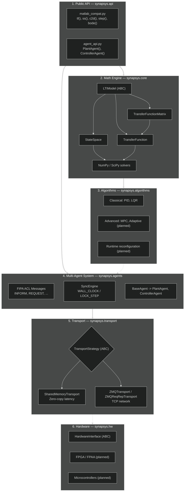

# Architecture

Synapsys is built in **six layers**. Each layer has a single responsibility and depends only on the layers below. This means you can use the mathematical core alone without touching the agent infrastructure, or swap the transport without changing any control logic.

## Layer diagram



## Design decisions

### API / math engine separation

The `synapsys.api` layer is a convenience wrapper only. All mathematics lives in `synapsys.core`. This allows the API to evolve without touching the numerical core.

### LTI class operator overloading

`G1 * G2` (series), `G1 + G2` (parallel), and `G.feedback()` allow composing systems with natural block algebra:

```python
T = (C * G).feedback()   # closed loop: C in series with G
```

`TransferFunctionMatrix` extends this algebra to MIMO plants: `*` performs matrix multiplication (series) and `+` is element-wise (parallel). Simulation and analysis delegate to a minimal `StateSpace` realisation built lazily by `to_state_space()`.

### Strategy pattern in transport

`PlantAgent` and `ControllerAgent` do not know **how** data is sent. They call `transport.write()` and `transport.read()`. The concrete implementation is injected at construction time — no control logic changes needed.

### Transport lifecycle

The transport is **owned by the caller**, not the agent. The agent never calls `transport.close()`. This prevents double-free when multiple agents share views of the same memory block.

### Continuous vs discrete

`StateSpace(A, B, C, D, dt=0)` is continuous. `dt > 0` is discrete. The same class supports both:

- `is_stable()` uses `Re(poles) < 0` for continuous and `|poles| < 1` for discrete
- `step()` delegates to `scipy.signal.step` or `scipy.signal.dstep` automatically
- `evolve(x, u)` executes `x(k+1) = Ax + Bu` step by step for real-time simulation
