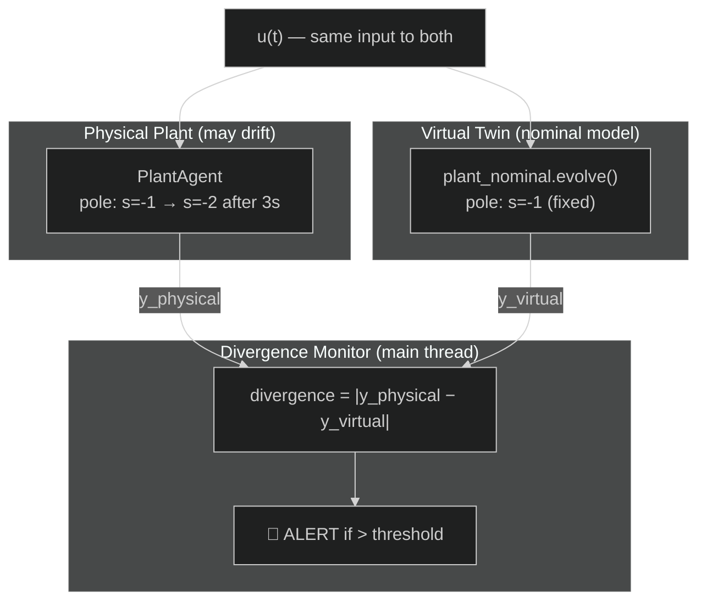

# Digital Twin with Anomaly Detection

**File:** `examples/advanced/05_digital_twin/05_digital_twin.py`

---

## What this example shows

The **Digital Twin** pattern: a virtual model of a physical system runs in parallel, fed with the same control inputs. When the physical system starts behaving differently from the model (due to wear or damage), the divergence metric triggers an alert.

---

## Architecture



---

## Theory

### Why digital twins detect wear

At $t=0$, both plant and twin have the same dynamics. The controller drives them to the same setpoint.

At $t=3\,\text{s}$ (wear injection), the physical plant's pole shifts:

$$
\text{Nominal: } G(s) = \frac{1}{s+1} \quad\longrightarrow\quad \text{Worn: } G(s) = \frac{1}{s+2}
$$

The worn plant responds **twice as fast** but to a **different magnitude**. The twin, still using $G(s) = \frac{1}{s+1}$, diverges from the physical output. The divergence metric:

$$
\delta(t) = |y_{\text{physical}}(t) - y_{\text{virtual}}(t)|
$$

grows past the alert threshold $\delta_{\text{thr}} = 0.15$ within a few ticks of the wear event.

### Virtual twin evolution

The twin evolves **in the main thread** via `evolve()`, synchronised with each bus read:

```python
# Read physical output from bus
y_physical = monitor.read("y")[0]
u_current  = monitor.read("u")[0]

# Step the twin with the SAME u
x_virtual, y_virtual_arr = plant_nominal.evolve(
    x_virtual, np.array([u_current])
)
```

This guarantees that both the physical and virtual outputs are computed with the same `u(t)` — the only difference is the internal model.

---

## Wear injection — hot swap

The plant model is swapped at runtime without stopping the controller or the bus:

```python
if elapsed >= DRIFT_AT:
    plant_agent.stop()                              # graceful shutdown
    plant_agent = PlantAgent("worn", drifted_model, ...)
    plant_agent.start(blocking=False)               # restart with new model
```

The bus, controller, and virtual twin continue uninterrupted.

---

## Result


**Panel 1 — Physical vs Virtual:** outputs are identical until $t=3\,\text{s}$, then diverge.

**Panel 2 — Anomaly Detection:** the red fill shows ticks where $\delta(t) > 0.15$. The alert zone grows steadily after the wear event.

**Panel 3 — Control signal:** the PID compensates more aggressively post-wear because the plant dynamics have changed.

---

## Real-world applications

| Domain | Physical system | Wear signature |
|---|---|---|
| Industrial | Pump or motor | Increased damping, reduced efficiency |
| Aerospace | Control surface | Actuator stiffness change |
| Structural | Bridge or building | Natural frequency shift |
| Process control | Heat exchanger | Fouling increases thermal resistance |

---

## How to run

Single terminal — runs for 8 seconds then plots:

```bash
uv run python examples/advanced/05_digital_twin/05_digital_twin.py
```

Expected terminal output:
```
[t=3.00s] ⚠  Wear injected: plant pole drifted -1 → -2
[t=3.05s] 🔴 ALERT: divergence = 0.18 > 0.15
...
Simulation complete. N ticks with divergence > 0.15.
```
