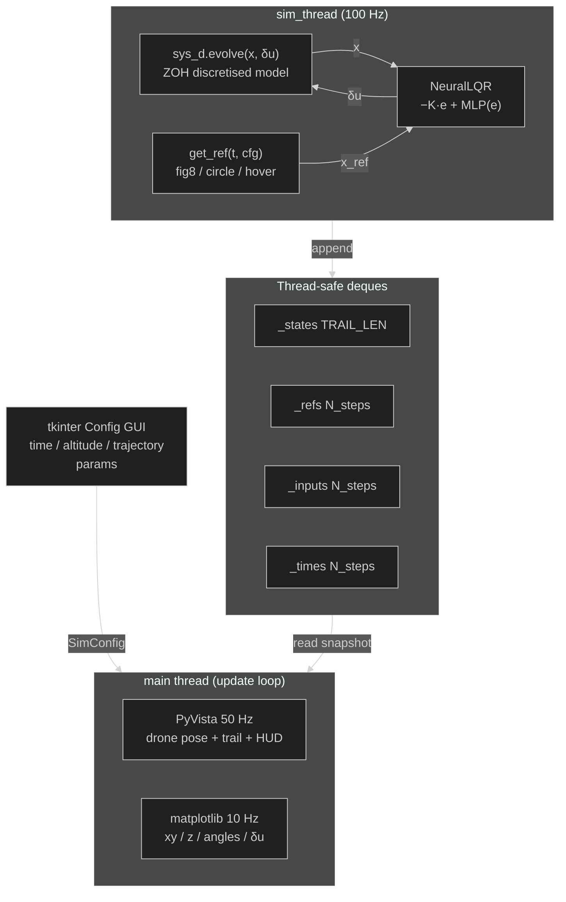

# Quadcopter MIMO — Neural-LQR Controller with Real-Time 3D Animation

**Files:** `examples/advanced/06_quadcopter_mimo/`

---

## What this example shows

A complete real-time simulation of a **12-state quadcopter** controlled by a **physics-informed Neural-LQR** — and visualised simultaneously in a 3D PyVista scene and a live matplotlib telemetry window. Before the simulation starts, a **tkinter configuration GUI** lets you choose the reference trajectory, tune its parameters, and set the simulation duration.

| Concept | Detail |
|---|---|
| **MIMO LTI modelling** | 12-state linearised hover model built with `synapsys.api.ss()` |
| **MIMO LQR** | `synapsys.algorithms.lqr()` on a 12-state / 4-input plant |
| **Residual Neural-LQR** | `δu = −K·e + MLP(e)` — residual zeroed at init → starts at optimal LQR |
| **Config GUI** | tkinter dialog: simulation time, altitude, reference trajectory & its parameters |
| **PyVista 3D** | Real-time drone pose animation + trajectory trail at 50 Hz |
| **matplotlib telemetry** | Position tracking, Euler angles, control inputs — live at 10 Hz |

---

## Physical model — linearised hover

A quadcopter has highly non-linear dynamics, but in the neighbourhood of **hover** (zero velocity, level attitude) a first-order Taylor expansion yields a useful **linear time-invariant (LTI)** model valid for small perturbations (|φ|, |θ| ≤ 15°).

### State and input vectors

$$
\mathbf{x} =
\begin{bmatrix}
x & y & z & \varphi & \theta & \psi &
\dot{x} & \dot{y} & \dot{z} & p & q & r
\end{bmatrix}^\top \in \mathbb{R}^{12}
$$

$$
\delta\mathbf{u} =
\begin{bmatrix}
\delta F & \tau_\varphi & \tau_\theta & \tau_\psi
\end{bmatrix}^\top \in \mathbb{R}^{4}
$$

where $(\varphi, \theta, \psi)$ are roll, pitch, yaw; $(p, q, r)$ are body angular rates; and $\delta\mathbf{u}$ represents **deviations from hover equilibrium** (hovering at $F = mg$).

### Linearised A and B matrices

The state equation $\dot{\mathbf{x}} = A\mathbf{x} + B\,\delta\mathbf{u}$ at hover is:

$$
A =
\begin{bmatrix}
0_{3\times 3} & 0_{3\times 3} & I_{3\times 3} & 0_{3\times 3} \\
0_{3\times 3} & 0_{3\times 3} & 0_{3\times 3} & I_{3\times 3} \\
0 & 0 & 0 & g & 0 & 0 & 0_{3\times 6} \\
0 & 0 & 0 & -g & 0 & 0 & 0_{3\times 6} \\
0_{6\times 12}
\end{bmatrix}
$$

The key gravity-coupling terms are $A_{6,4} = +g$ (forward acceleration from pitch $\theta$) and $A_{7,3} = -g$ (lateral acceleration from roll $\varphi$):

```
ẍ = +g·θ     (pitch forward → accelerate in x)
ÿ = −g·φ     (roll right → accelerate in −y)
```

The input matrix maps each control channel to its dynamical effect:

$$
B =
\begin{bmatrix}
0_{8 \times 4} \\
1/m & 0 & 0 & 0 \\
0 & 1/I_{xx} & 0 & 0 \\
0 & 0 & 1/I_{yy} & 0 \\
0 & 0 & 0 & 1/I_{zz}
\end{bmatrix}
$$

Physical parameters (500 mm racing quad):

| Symbol | Value | Meaning |
|---|---|---|
| $m$ | 0.500 kg | Total mass |
| $I_{xx} = I_{yy}$ | 4.856 × 10⁻³ kg·m² | Roll / pitch inertia |
| $I_{zz}$ | 8.801 × 10⁻³ kg·m² | Yaw inertia |
| $\ell$ | 0.175 m | Centre-to-motor arm |

The continuous-time model is built with `synapsys.api.ss()` and discretised at 100 Hz with `synapsys.api.c2d()` using the zero-order-hold (ZOH) method:

```python
from synapsys.api import ss, c2d

A, B, C, D = build_matrices()   # from quadcopter_dynamics.py
sys_c = ss(A, B, C, D)          # continuous-time LTI
sys_d = c2d(sys_c, dt=0.01)     # ZOH discretisation at 100 Hz
```

---

## LQR design

The **Linear Quadratic Regulator** minimises the infinite-horizon cost:

$$
J = \int_0^\infty \bigl(\mathbf{e}^\top Q\,\mathbf{e} + \delta\mathbf{u}^\top R\,\delta\mathbf{u}\bigr)\,dt
$$

where $\mathbf{e} = \mathbf{x} - \mathbf{x}_\text{ref}$ is the tracking error. The optimal gain matrix $K$ is found by solving the **Algebraic Riccati Equation** (ARE):

$$
A^\top P + PA - PBR^{-1}B^\top P + Q = 0
\quad\Rightarrow\quad K = R^{-1}B^\top P
$$

Weight matrices used in this example:

```python
Q = diag([20, 20, 30,    # x, y, z       — position errors
           3,  3,  8,    # φ, θ, ψ       — attitude (yaw weighted more)
           2,  2,  4,    # ẋ, ẏ, ż       — linear velocity
          0.5, 0.5, 1])  # p, q, r       — angular rates

R = diag([0.5, 3.0, 3.0, 5.0])   # δF, τφ, τθ, τψ
```

```python
from synapsys.algorithms import lqr

K, P = lqr(A, B, Q, R)
# K.shape == (4, 12)
# All closed-loop eigenvalues have Re < 0  ✓
```

The resulting $K \in \mathbb{R}^{4 \times 12}$ yields a **closed-loop** system $A - BK$ with all eigenvalues in the left half-plane (Re < 0), confirming asymptotic stability.

---

## Neural-LQR controller

### Residual architecture

The controller extends LQR with a learnable residual term:

$$
\delta\mathbf{u} = \underbrace{-K\,\mathbf{e}}_{\text{LQR baseline}} + \underbrace{\text{MLP}(\mathbf{e})}_{\text{residual}}
$$

The MLP has architecture **12 → 64 → 32 → 4** with Tanh activations. At initialisation the **output layer weights and biases are zeroed**, so the network starts as pure LQR and the residual can be trained later via RL or imitation learning without changing any API.

```python
class NeuralLQR(nn.Module):
    def __init__(self, K_np):
        super().__init__()
        self.register_buffer("K", torch.tensor(K_np, dtype=torch.float32))
        self.residual = nn.Sequential(
            nn.Linear(12, 64), nn.Tanh(),
            nn.Linear(64, 32), nn.Tanh(),
            nn.Linear(32,  4),            # ← zeroed at init
        )
        with torch.no_grad():
            nn.init.zeros_(self.residual[4].weight)
            nn.init.zeros_(self.residual[4].bias)

    def forward(self, e):
        return -(e @ self.K.T) + self.residual(e)
```

### Why this design?

| Property | Benefit |
|---|---|
| **Stability at t = 0** | LQR baseline is provably stable; residual adds nothing until trained |
| **Smooth fine-tuning** | RL or IL can adjust the residual without destabilising the loop |
| **Interpretable fallback** | Remove/zero the MLP → revert to known-optimal LQR at any time |

---

## Reference trajectories

Three reference trajectories are available via the config GUI:

### Figure-8 — Lemniscate of Bernoulli

$$
x_\text{ref}(t) = \frac{A\cos(\omega t)}{1 + \sin^2(\omega t)}, \qquad
y_\text{ref}(t) = \frac{A\sin(\omega t)\cos(\omega t)}{1 + \sin^2(\omega t)}, \qquad
z_\text{ref} = z_h
$$

Default: $A = 0.8$ m, $\omega = 0.35$ rad/s.

### Circle

$$
x_\text{ref}(t) = R\cos(\omega t), \qquad
y_\text{ref}(t) = R\sin(\omega t), \qquad
z_\text{ref} = z_h
$$

Default: $R = 1.0$ m, $\omega = 0.30$ rad/s.

### Hover (static)

$$
\mathbf{x}_\text{ref} = [0,\; 0,\; z_h,\; 0, \ldots, 0]^\top
$$

All three trajectories share the takeoff phase: the drone climbs from the ground to hover altitude $z_h$ during the first $t_\text{hover}$ seconds before tracking begins.

---

## Architecture



All data flows from `sim_thread` into **thread-safe `collections.deque` buffers** protected by a single `threading.Lock`. The main thread reads snapshots without blocking the simulation.

---

## Config GUI

When the script is launched a **tkinter dialog** appears before any simulation window opens:

| Section | Controls |
|---|---|
| **Simulation Time** | Total duration (s), takeoff hover phase (s), hover altitude (m) |
| **Reference Trajectory** | Radio buttons: Figure-8 / Circle / Hover |
| **Figure-8 Parameters** | Amplitude slider (0.2–2.0 m), angular speed (0.1–0.8 rad/s) |
| **Circle Parameters** | Radius slider (0.2–3.0 m), angular speed (0.1–0.8 rad/s) |

Clicking **Run Simulation** closes the dialog, validates the configuration, and starts the simulation and visualisation windows. **Cancel** exits without running.

---

## Visualisation

### PyVista 3D window (50 Hz)


- **Drone mesh** — X-configuration body (box), 4 arms (cylinders) and 4 rotors (discs); pose updated via `actor.user_matrix` from the rotation matrix $R = R_z R_y R_x$ computed with `scipy.spatial.transform.Rotation`
- **Trajectory trail** — last `TRAIL_LEN = 500` positions as a `pv.PolyData` polyline, updated in place
- **Reference curve** — static preview of the chosen trajectory rendered at the start
- **HUD overlay** — live text showing mode, time, position, Euler angles, velocities

### matplotlib telemetry window (10 Hz)


| Panel | Content |
|---|---|
| **Top-left** | Top-down $x$–$y$ trajectory vs. reference curve |
| **Top-right** | Altitude $z(t)$ vs. reference line |
| **Middle** | Euler angles $\varphi$, $\theta$, $\psi$ in degrees |
| **Bottom** | Control deviations $\delta F$, $\tau_\varphi$, $\tau_\theta$, $\tau_\psi$ |

Both windows run in the **same main thread** using `pv.Plotter(interactive_update=True)` and `plt.ion()`, avoiding cross-thread GUI crashes. The simulation runs in a dedicated daemon thread.

---

## How to run

**Install dependencies:**

```bash
pip install synapsys[viz] torch matplotlib
```

**Run the standalone simulation:**

```bash
cd examples/advanced/06_quadcopter_mimo
python 06b_neural_lqr_3d.py
```

1. The tkinter config GUI opens — adjust parameters and click **Run Simulation**
2. A matplotlib telemetry window opens with 4 live panels
3. A PyVista 3D window opens with the drone animation
4. Close either window or press **Ctrl+C** to stop

**Export GIF recordings (no display needed):**

```bash
# Default: 20 s run, 15 fps 3D GIF + 7 fps telemetry GIF → current dir
python 06b_neural_lqr_3d.py --save

# Custom: 30 s, faster PyVista, slower telemetry, custom output folder
python 06b_neural_lqr_3d.py --save --fps 20 --mpl-fps 8 --out ./results
```

Saves `quadcopter_3d.gif` (~1.8 MB) and `quadcopter_telemetry.gif` (~4 MB) in under 2 minutes. Requires `pip install imageio`.

**Two-process SIL variant (optional):**

```bash
# Terminal 1 — start the linearised plant on shared memory
python 06a_quadcopter_plant.py

# Terminal 2 — connect an external controller via SharedMemoryTransport
# (adapt 06b to read from bus instead of running its own simulation)
```

:::tip[Extending the Neural-LQR]
The `NeuralLQR.residual` sub-network (12→64→32→4, Tanh) starts at zero — it does nothing until trained. Replace the zero-initialised weights with one trained via PPO, SAC, or DDPG and the rest of the example stays identical. The `synapsys` API calls (`ss()`, `c2d()`, `lqr()`, `evolve()`) do not change.
:::

:::tip[Adding velocity feedforward]
The current reference only prescribes position. For aggressive manoeuvres, add a kinematically consistent velocity feedforward ($\dot{x}_\text{ref}$, $\dot{y}_\text{ref}$) to the reference state — this reduces tracking error during the figure-8 phase significantly.
:::

:::warning[Linearisation limits]
The hover model is valid only for $|\varphi|, |\theta| \leq 15°$. Aggressive manoeuvres that exceed this envelope will cause divergence. For full-envelope flight, replace the LTI model with a non-linear model (e.g., Euler-Lagrange equations) and use feedback linearisation or NMPC.
:::

---

## File reference

| File | Purpose |
|---|---|
| `quadcopter_dynamics.py` | Physical constants, `build_matrices()`, `figure8_ref()`, LQR weights |
| `06a_quadcopter_plant.py` | Two-process SIL plant via `PlantAgent` + `SharedMemoryTransport` |
| `06b_neural_lqr_3d.py` | Standalone simulation: config GUI, Neural-LQR, PyVista 3D, matplotlib |

### Key synapsys API calls

| Call | What it does |
|---|---|
| `ss(A, B, C, D)` | Builds a continuous-time `StateSpace` object |
| `c2d(sys_c, dt)` | Discretises to ZOH discrete-time `StateSpace` |
| `sys_d.evolve(x, u)` | One-step state update: returns $(x_{k+1},\, y_k)$ |
| `lqr(A, B, Q, R)` | Solves ARE, returns gain matrix $K$ and cost matrix $P$ |
