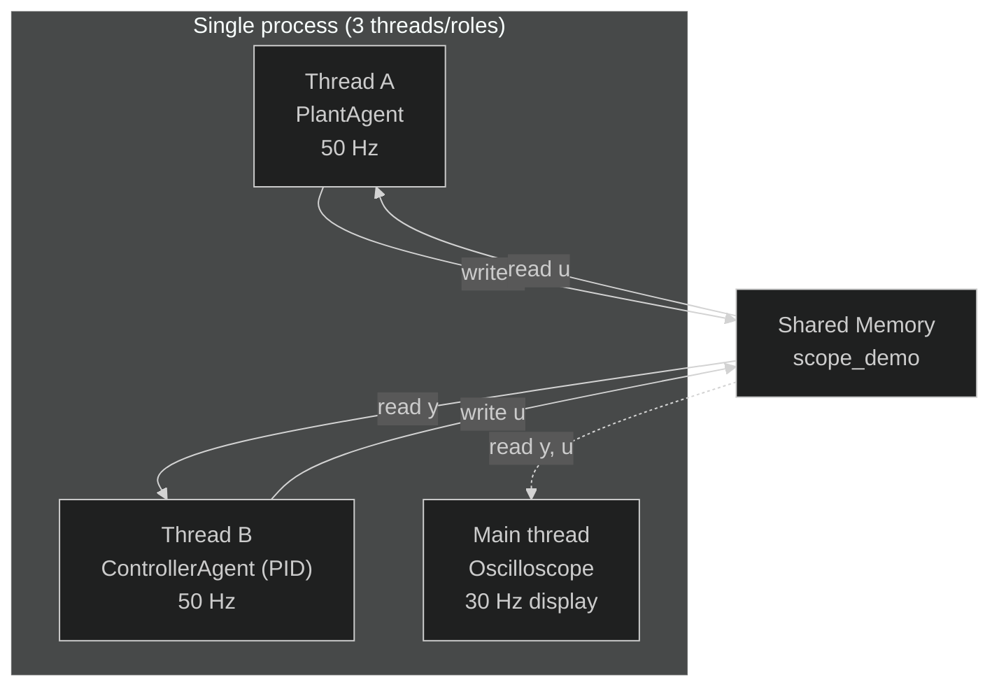

# Real-Time Oscilloscope with Sinusoidal Reference

**File:** `examples/advanced/04_realtime_oscilloscope/04_realtime_matplotlib.py`

---

## What this example shows

The most complete self-contained real-time simulation in Synapsys. Three concurrent roles — plant, controller, and oscilloscope — run simultaneously without blocking each other.

The control objective is **sinusoidal reference tracking**: the setpoint is a time-varying signal and the PID must keep the output following it continuously.

---

## Architecture



The plant and controller run in **background threads** (`blocking=False`). The main thread drives the `FuncAnimation` loop.

---

## Sinusoidal reference

$$
r(t) = 3 + 2\sin(2\pi \cdot 0.2 \cdot t)
$$

A 0.2 Hz (5-second period) sinusoid with DC offset 3. The PID must compute `u(t)` at every tick so that `y(t) ≈ r(t)` despite plant dynamics introducing a phase lag.

The reference is evaluated from wall-clock time via a **closure**:

```python
t_start = time.monotonic()

def law(y):
    r = SP_OFFSET + SP_AMP * np.sin(2 * np.pi * SP_FREQ * (time.monotonic() - t_start))
    return np.array([pid.compute(setpoint=r, measurement=y[0])])
```

Each call to `law(y)` reads the current time, computes `r(t)`, and feeds it to the PID — no external coordination needed.

---

## Rolling window oscilloscope

```python
WINDOW = 200   # samples (200 × 0.02 s = 4 s visible)
buf_t = deque([0.0] * WINDOW, maxlen=WINDOW)
buf_y = deque([0.0] * WINDOW, maxlen=WINDOW)
```

`deque(maxlen=N)` automatically discards the oldest sample when a new one is appended. The x-axis scrolls forward:

```python
x_min = max(0.0, now - WINDOW * DT)
x_max = x_min + WINDOW * DT
ax.set_xlim(x_min, x_max)
```

---

## PID tuning

```python
pid = PID(Kp=6.0, Ki=2.0, dt=DT, u_min=-15.0, u_max=15.0)
```

| Parameter | Value | Rationale |
|---|---|---|
| `Kp` | 6.0 | Fast proportional response for sinusoidal tracking |
| `Ki` | 2.0 | Eliminates the phase-lag-induced steady-state error |
| `u_min/max` | ±15 | Anti-windup saturation |

---

## Result


`y(t)` (blue) tracks `r(t)` (dashed) with a small phase lag introduced by the plant dynamics. `u(t)` (orange) oscillates as the PID continuously compensates — amplitude grows when tracking error grows (bottom of the sine) and shrinks when the error is small.

---

## How to run

Single terminal — everything runs in-process:

```bash
uv run python examples/advanced/04_realtime_oscilloscope/04_realtime_matplotlib.py
```

The oscilloscope window opens immediately. Close it to stop the simulation.
