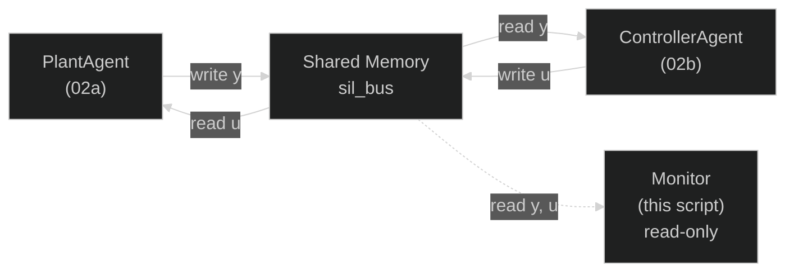

# Real-Time Headless Scope

**File:** `examples/advanced/03_realtime_scope/03_realtime_scope.py`

---

## What this example shows

A **read-only bus monitor** that attaches to an existing shared memory bus and displays live signal values in the terminal — no GUI required. It demonstrates the **observer pattern**: any number of monitors can attach to the bus without affecting the closed-loop simulation.

---

## Architecture



The dashed line indicates the monitor **never writes** to the bus — it is completely transparent to the simulation.

---

## Use cases

- **Debugging over SSH** — no display server needed
- **Logging** — redirect stdout to a file: `script.py >> log.txt`
- **Sanity checking** before launching a full matplotlib oscilloscope
- **CI pipelines** — verify signals are non-zero without a GUI

---

## Code

```python
from synapsys.broker import MessageBroker, Topic, SharedMemoryBackend
import time, sys

topic_state = Topic("sil/state", shape=(4,))
topic_u     = Topic("sil/u",     shape=(1,))

broker = MessageBroker()
broker.declare_topic(topic_state)
broker.declare_topic(topic_u)
broker.add_backend(
    SharedMemoryBackend("sil_2dof", [topic_state, topic_u], create=False)
)

start_time = time.time()

try:
    while True:
        state   = broker.read("sil/state")
        u       = broker.read("sil/u")[0]
        elapsed = time.time() - start_time

        sys.stdout.write(
            f"\r[t={elapsed:6.2f}s]  "
            f"x1={state[0]:7.4f}  x2={state[1]:7.4f}  "
            f"v1={state[2]:7.4f}  v2={state[3]:7.4f}  u={u:8.4f}"
        )
        sys.stdout.flush()
        time.sleep(0.05)   # 20 Hz display rate
except KeyboardInterrupt:
    pass
finally:
    broker.close()
```

### How the in-place update works

`\r` (carriage return) moves the cursor to the beginning of the current line without advancing to the next line. Combined with `sys.stdout.flush()`, this creates a continuously updating single line — the classic terminal oscilloscope effect.

`time.sleep(0.05)` sets a 20 Hz display rate. The actual simulation runs at 100 Hz — the monitor samples it at a lower rate, which is sufficient for visual inspection.

---

## How to run

Requires the plant and controller already running:

```bash
# Terminal 1
uv run python examples/advanced/02_sil_ai_controller/02a_sil_plant.py

# Terminal 2
uv run python examples/advanced/02_sil_ai_controller/02b_sil_ai_controller.py

# Terminal 3 — headless monitor
uv run python examples/advanced/03_realtime_scope/03_realtime_scope.py
```

Press `Ctrl+C` to stop the monitor. The plant and controller keep running.

---

## Source

| File | Description |
|------|-------------|
| [`examples/advanced/03_realtime_scope/03_realtime_scope.py`](https://github.com/synapsys-lab/synapsys/blob/main/examples/advanced/03_realtime_scope/03_realtime_scope.py) | Headless terminal monitor — read-only observer connecting to the `sil_2dof` bus |
