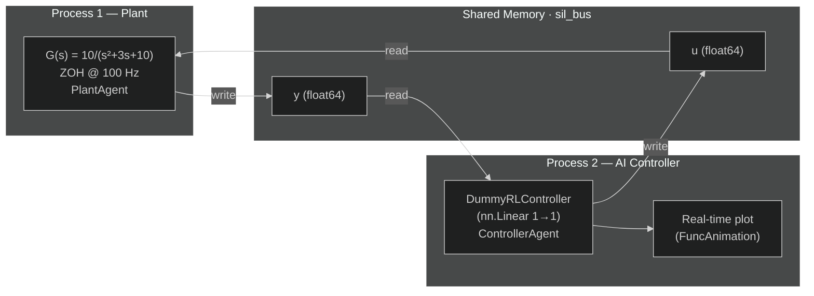

# Software-in-the-Loop with AI Controller

**Files:** `examples/advanced/02_sil_ai_controller/`

---

## What this example shows

A two-process **SIL (Software-in-the-Loop)** simulation where:
- `02a_sil_plant.py` — runs the physical plant model in real time
- `02b_sil_ai_controller.py` — runs a **PyTorch neural network** as the controller, with a **live real-time plot**

Both processes communicate through a **shared memory bus** — zero-copy, no network stack.

---

## Architecture



---

## Theory — SIL vs MIL

| Aspect | MIL (Batch) | SIL (Real-time) |
|---|---|---|
| Time | CPU speed | Wall-clock |
| Processes | 1 | 2+ |
| Communication | Function call | IPC bus |
| Timing effects | Not visible | Latency, jitter visible |
| Use case | Algorithm validation | Integration testing |

---

## Plant (`02a_sil_plant.py`)

```python
plant_c = tf([10], [1, 3, 10])   # G(s) = 10/(s²+3s+10)
plant_d = c2d(plant_c, dt=0.01)  # ZOH discretisation @ 100 Hz
```

`c2d` converts the continuous TF to a discrete state-space model using **Zero-Order Hold (ZOH)** — the input $u$ is assumed constant between samples.

At each tick the `PlantAgent` executes:

$$
x(k+1) = Ax(k) + Bu(k)
$$
$$
y(k) = Cx(k) + Du(k)
$$

---

## AI Controller (`02b_sil_ai_controller.py`)

The `DummyRLController` is a **PyTorch** `nn.Linear(1→1)` with fixed weights that mimic a proportional controller:

$$
u = w \cdot y + b = -0.5 \cdot y + 1.0
$$

In a real application, the weights would be trained by a Reinforcement Learning algorithm. The integration pattern is identical regardless of model complexity:

```python
def ai_control_law(y: np.ndarray) -> np.ndarray:
    state_tensor = torch.tensor(y, dtype=torch.float32)
    with torch.no_grad():
        u = model(state_tensor).numpy()   # forward pass
    return u
```

```
numpy array  →  torch.Tensor  →  nn.forward()  →  numpy array
```

`torch.no_grad()` disables gradient tracking during inference — faster and uses less memory.

---

## Real-time plot

The controller runs in a **background thread** while the main thread drives the animation:

```python
ai_ctrl.start(blocking=False)   # → background thread
plt.show()                      # main thread — blocks until window closed
```

A `collections.deque(maxlen=300)` acts as a **circular buffer** (3 s window at 100 Hz). `deque.append()` is thread-safe, allowing the background thread to write while the main thread reads for plotting.

---

## Result


`y(t)` rises from 0 and stabilises. `u(t)` decreases as the plant output grows — the proportional action reduces the control effort as the output approaches its steady-state value.

---

## How to run

Open two terminals:

```bash
# Terminal 1 — start the plant first
uv run python examples/advanced/02_sil_ai_controller/02a_sil_plant.py

# Terminal 2 — connect the AI controller
uv run python examples/advanced/02_sil_ai_controller/02b_sil_ai_controller.py
```

A matplotlib window opens with live `y(t)` and `u(t)` traces. Close the window to stop.

:::tip[Port conflict]
If you get `Address already in use`, run `fuser -k 5555/tcp 5556/tcp` to release stale sockets.
:::
