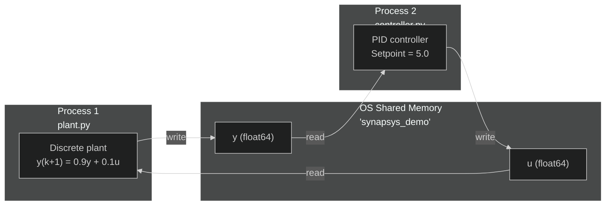

# Distributed Simulation via Shared Memory

**Files:** `examples/distributed/01_shared_memory/`

---

## What this example shows

How to split plant and controller into **two separate processes** communicating via **shared memory IPC** — no network, no sockets, no file I/O. Both processes run on the same machine and the OS maps the same physical memory pages into both address spaces.

---

## Architecture



---

## Why two processes?

| Concern | Single process | Two processes |
|---|---|---|
| Fault isolation | Controller crash kills plant | Independent — one can restart |
| Rate independence | Must share a clock | Plant at 20 Hz, controller at 40 Hz |
| Deployment | Always co-located | Can be on separate machines |
| Realistic testing | Shared memory, shared state | Mimics real embedded architecture |

---

## Plant (`plant.py`)

```python
with SharedMemoryTransport(BUS_NAME, CHANNELS, create=True) as bus:
    bus.write("y", np.array([0.0]))
    bus.write("u", np.array([0.0]))
    time.sleep(2.0)   # wait for controller to connect

    for k in range(N_STEPS):
        u = bus.read("u")[0]
        y = bus.read("y")[0]

        y_next = 0.9 * y + 0.1 * u   # discrete first-order dynamics
        bus.write("y", np.array([y_next]))
        time.sleep(DT)
```

The plant **creates** the shared memory block (`create=True`). The `with` block ensures the OS resource is released even on crash.

Discrete dynamics: $y(k+1) = 0.9\,y(k) + 0.1\,u(k)$ — equivalent to $G(s)=\tfrac{1}{s+1}$ with ZOH at ~20 Hz.

---

## Controller (`controller.py`)

```python
with SharedMemoryTransport(BUS_NAME, CHANNELS, create=False) as bus:
    while True:
        y = bus.read("y")[0]
        u = pid.compute(setpoint=5.0, measurement=y)
        bus.write("u", np.array([u]))
        time.sleep(DT)    # 40 Hz
```

The controller **connects** to the existing block (`create=False`). It runs at **40 Hz** — twice the plant rate. Between plant updates, the controller reuses the last `y` value. This demonstrates **rate decoupling**: processes do not need to be synchronised.

PID parameters: `Kp=3.0, Ki=0.5, dt=0.025` — tuned to drive `y` to `setpoint=5.0`.

---

## How to run

```bash
# Terminal 1 — start plant first
uv run python examples/distributed/01_shared_memory/plant.py

# Terminal 2 — connect controller (within 2 s)
uv run python examples/distributed/01_shared_memory/controller.py
```

You should see `y` converge to `5.0` within the first few steps. The plant runs for 200 steps (~10 s) then exits. Press `Ctrl+C` to stop the controller.
