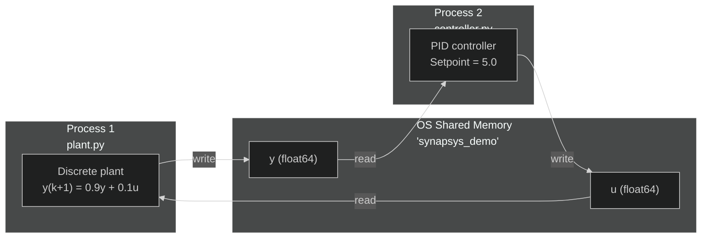

# Distributed Simulation via Shared Memory

**Files:** `examples/distributed/01_shared_memory/`

---

## What this example shows

How to split plant and controller into **two separate processes** communicating via **shared memory IPC** — no network, no sockets, no file I/O. Both processes run on the same machine and the OS maps the same physical memory pages into both address spaces.

---

## Architecture



---

## Why two processes?

| Concern | Single process | Two processes |
|---|---|---|
| Fault isolation | Controller crash kills plant | Independent — one can restart |
| Rate independence | Must share a clock | Plant at 20 Hz, controller at 40 Hz |
| Deployment | Always co-located | Can be on separate machines |
| Realistic testing | Shared memory, shared state | Mimics real embedded architecture |

---

## Plant (`plant.py`)

```python
topic_y = Topic("plant/y", shape=(1,))
topic_u = Topic("plant/u", shape=(1,))

broker = MessageBroker()
broker.declare_topic(topic_y)
broker.declare_topic(topic_u)
broker.add_backend(SharedMemoryBackend(BUS_NAME, [topic_y, topic_u], create=True))

broker.publish("plant/y", np.zeros(1))
broker.publish("plant/u", np.zeros(1))

sync  = SyncEngine(SyncMode.WALL_CLOCK, dt=DT)
agent = PlantAgent(
    "plant", plant_d, None, sync,
    channel_y="plant/y", channel_u="plant/u", broker=broker,
)
agent.start(blocking=True)
```

The plant **creates** the shared memory block (`create=True`). The `PlantAgent` automatically handles the discrete-time simulation loop — no manual `for k in range(...)` needed.

Discrete dynamics: $y(k+1) = 0.9\,y(k) + 0.1\,u(k)$ — equivalent to $G(s)=\tfrac{1}{s+1}$ with ZOH at ~20 Hz.

---

## Controller (`controller.py`)

```python
topic_y = Topic("plant/y", shape=(1,))
topic_u = Topic("plant/u", shape=(1,))

broker = MessageBroker()
broker.declare_topic(topic_y)
broker.declare_topic(topic_u)
broker.add_backend(SharedMemoryBackend(BUS_NAME, [topic_y, topic_u], create=False))

law   = lambda y: np.array([pid.compute(setpoint=5.0, measurement=y[0])])
sync  = SyncEngine(SyncMode.WALL_CLOCK, dt=DT)
agent = ControllerAgent(
    "ctrl", law, None, sync,
    channel_y="plant/y", channel_u="plant/u", broker=broker,
)
agent.start(blocking=True)
```

The controller **connects** to the existing block (`create=False`). It runs at **40 Hz** — twice the plant rate. This demonstrates **rate decoupling**: processes do not need to be synchronised.

PID parameters: `Kp=3.0, Ki=0.5, dt=0.025` — tuned to drive `y` to `setpoint=5.0`.

---

## How to run

```bash
# Terminal 1 — start plant first
uv run python examples/distributed/01_shared_memory/plant.py

# Terminal 2 — connect controller (within 2 s)
uv run python examples/distributed/01_shared_memory/controller.py
```

You should see `y` converge to `5.0` within the first few steps. The plant runs for 200 steps (~10 s) then exits. Press `Ctrl+C` to stop the controller.
