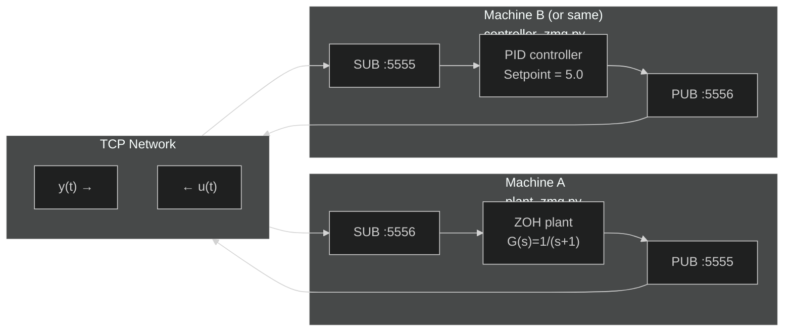

# Distributed Simulation via ZeroMQ

**Files:** `examples/distributed/02_zmq/`

---

## What this example shows

Extends distributed simulation to **network communication** using **ZeroMQ**. The plant and controller can run on **different machines** connected over TCP — a realistic HIL/distributed-control scenario.

---

## Architecture



---

## ZeroMQ PUB/SUB pattern

ZMQ's **Publisher-Subscriber** pattern is ideal for sensor data streaming:

| Feature | Raw TCP | ZMQ PUB/SUB |
|---|---|---|
| Reconnection | Manual | Automatic |
| Multiple subscribers | Complex | Built-in |
| Message framing | Manual | Built-in |
| Language support | OS-specific | 40+ languages |

`ZMQTransport` serialises numpy arrays to bytes and uses the channel name as the ZMQ topic prefix.

---

## Plant (`plant_zmq.py`)

```python
pub = ZMQTransport("tcp://0.0.0.0:5555", mode="pub")   # publish y
sub = ZMQTransport(f"tcp://{CONTROLLER_HOST}:5556", mode="sub")  # subscribe u
sub._socket.setsockopt(0x8, 100)   # ZMQ_RCVTIMEO = 100 ms

u = np.array([0.0])

for k in range(N_STEPS):
    x, y = plant_d.evolve(x, u)
    pub.write("y", y)

    try:
        u = sub.read("u")    # non-blocking — raises on timeout
    except Exception:
        pass                 # ZOH: keep previous u if controller hasn't sent yet
```

The **ZOH fallback** (`except: pass`) prevents the plant from stalling if the controller hasn't sent `u` yet — it simply reuses the last value.

---

## Controller (`controller_zmq.py`)

```python
sub = ZMQTransport(f"tcp://{PLANT_HOST}:5555", mode="sub")
pub = ZMQTransport("tcp://0.0.0.0:5556", mode="pub")

while True:
    try:
        y = sub.read("y")
        u = pid.compute(setpoint=5.0, measurement=y[0])
        pub.write("u", np.array([u]))
    except Exception:
        pass   # plant not ready yet; retry
```

The controller runs at **2× the plant rate** (`DT=0.025s` vs `DT=0.05s`). Extra cycles silently skip if no new `y` is available — the controller never blocks.

---

## Deadline-based timing

Both scripts use a **deadline sleep** for accurate timing:

```python
elapsed = time.monotonic() - t0
if DT - elapsed > 0:
    time.sleep(DT - elapsed)
```

This compensates for computation time: if the step took 2 ms and `DT=50 ms`, it sleeps 48 ms instead of a fixed 50 ms — avoiding drift.

---

## Running on two machines

Change the host variables:

```python
# On Machine A (plant)
CONTROLLER_HOST = "192.168.1.42"   # IP of Machine B

# On Machine B (controller)
PLANT_HOST = "192.168.1.10"        # IP of Machine A
```

Ensure ports **5555** and **5556** are open in the firewall.

---

## How to run (same machine)

```bash
# Terminal 1
uv run python examples/distributed/02_zmq/plant_zmq.py

# Terminal 2
uv run python examples/distributed/02_zmq/controller_zmq.py
```

The plant runs for 300 steps (~15 s). Press `Ctrl+C` to stop the controller.

:::warning[Port conflict]
If a previous run left sockets open, run `fuser -k 5555/tcp 5556/tcp` before starting.
:::
