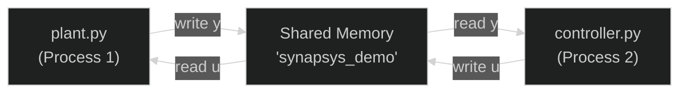
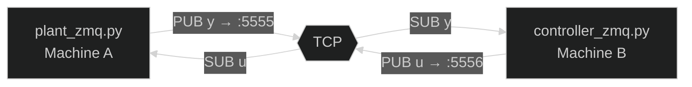

# Quick Start

This guide walks through the five core workflows of Synapsys — from a single transfer function to a full distributed closed-loop simulation. Each section builds on the previous one.

:::tip[Prerequisites]
Install Synapsys before starting: `pip install synapsys` or `uv add synapsys`
:::

---

## 1. Analysing a Continuous-Time System

A **transfer function** $G(s)$ describes how a linear time-invariant (LTI) system transforms an input $U(s)$ into an output $Y(s)$ in the Laplace domain:

$$G(s) = \frac{Y(s)}{U(s)} = \frac{\omega_n^2}{s^2 + 2\zeta\omega_n s + \omega_n^2}$$

Key parameters:
- $\omega_n$ — **natural frequency**: how fast the system oscillates (rad/s)
- $\zeta$ — **damping ratio**: how quickly oscillations decay (`0 < ζ < 1` → underdamped)

The **step response** — output when the input jumps from 0 to 1 at $t=0$ — reveals the dynamic behaviour: overshoot, rise time, and settling time.

```python
from synapsys.api import tf, step
import matplotlib.pyplot as plt

# G(s) = ωn² / (s² + 2ζωn·s + ωn²)
wn, zeta = 10.0, 0.5
G = tf([wn**2], [1, 2*zeta*wn, wn**2])

# Inspect the system
print(f"Poles:      {G.poles()}")      # complex conjugate pair
print(f"DC gain:    {G.evaluate(0).real:.4f}")   # G(0) = 1.0
print(f"Stable:     {G.is_stable()}")  # True — all poles in left half-plane

# Compute and plot step response
t, y = step(G)

plt.figure(figsize=(9, 4))
plt.plot(t, y, label="y(t)")
plt.axhline(1.0, color="gray", ls="--", alpha=0.6, label="setpoint")
plt.xlabel("Time (s)"); plt.ylabel("y(t)")
plt.title("Step Response"); plt.legend(); plt.grid(True)
plt.show()
```


The system overshoots by ~16.4% and settles (within ±2% of the setpoint) at ~0.24 s. Both are directly predictable from $\zeta = 0.5$:

$$\text{Overshoot} = e^{-\pi\zeta/\sqrt{1-\zeta^2}} \approx 16.3\%$$

---

## 2. Closed-Loop with Unity Negative Feedback

An **open-loop** system amplifies the input but cannot reject disturbances or correct steady-state error. **Closing the loop** with negative feedback trades some gain for stability and disturbance rejection.

For a plant $G(s)$ with unity negative feedback, the closed-loop transfer function is:

$$T(s) = \frac{G(s)}{1 + G(s)}$$

```python
from synapsys.api import tf, feedback, step

G = tf([10], [1, 1])       # G(s) = 10/(s+1)  — DC gain = 10
T = feedback(G)            # T(s) = 10/(s+11) — DC gain = 10/11 ≈ 0.909

print(f"Open-loop  DC gain: {G.evaluate(0).real:.4f}")   # 10.0
print(f"Closed-loop DC gain: {T.evaluate(0).real:.4f}")  # 0.9091

t, y = step(T)
```


**Open-loop** (left): the output rises to 10× the input and settles slowly — no reference tracking, just amplification.

**Closed-loop** (right): `feedback(G)` reduces the DC gain to $\frac{10}{1+10} \approx 0.909$. This residual error ($\approx 9\%$) is the **steady-state error** inherent to a proportional-only loop. Adding an integrator (see section 4) eliminates it.

:::tip[`feedback()` API]
`feedback(G)` computes `G/(1+G)`.  
`feedback(G, C)` computes the loop `G·C/(1+G·C)` with controller `C` in the forward path.
:::

---

## 3. Discretisation

Real controllers run on digital hardware at a fixed **sampling rate**. `c2d` converts a continuous model to a discrete one using **Zero-Order Hold (ZOH)** — assuming the control input $u$ is constant between samples:

$$G_d(z) = \mathcal{Z}\left\{G(s) \cdot \frac{1 - e^{-sT_s}}{s}\right\}$$

Choosing the right sampling period $T_s$ is critical:
- **Too slow** ($T_s$ large): aliasing, poor approximation of the continuous dynamics
- **Too fast** ($T_s$ small): unnecessary computation, numerical issues
- **Rule of thumb**: $T_s \leq \frac{1}{10 f_{\text{bandwidth}}}$ — sample at least 10× the system bandwidth

```python
from synapsys.api import tf, c2d, step

G = tf([1], [1, 2, 1])        # G(s) = 1/(s+1)² — continuous

Gd_fast = c2d(G, dt=0.05)     # 20 Hz — well above bandwidth
Gd_slow = c2d(G, dt=0.5)      # 2 Hz — too coarse

print(f"Discrete (fast): {Gd_fast.is_discrete}")  # True
print(f"Stable:          {Gd_fast.is_stable()}")   # True

# Step response — 200 samples
t_fast, y_fast = step(Gd_fast, n=200)
t_slow, y_slow = step(Gd_slow, n=20)
```


At 20 Hz (green) the discrete response is virtually identical to the continuous one. At 2 Hz (red dashed) the ZOH staircase is clearly visible — the output holds each sample until the next tick.

---

## 4. PID Control

A **PID controller** computes the control action from three terms:

$$u(t) = K_p\,e(t) + K_i\int_0^t e(\tau)\,d\tau + K_d\,\dot{e}(t)$$

where $e(t) = r(t) - y(t)$ is the tracking error.

| Term | Effect | Tuning |
|---|---|---|
| $K_p$ (proportional) | Speed of response | Higher → faster, but more overshoot |
| $K_i$ (integral) | Eliminates steady-state error | Higher → faster correction, but more overshoot/oscillation |
| $K_d$ (derivative) | Damps oscillations | Higher → smoother, but sensitive to noise |

Synapsys provides a **discrete PID with anti-windup saturation** — the integrator is clamped to `[u_min, u_max]` to prevent integrator windup when the actuator saturates.

```python
from synapsys.api import tf, c2d
from synapsys.algorithms import PID
import numpy as np

DT = 0.02
plant_d = c2d(tf([25], [1, 5, 25]), dt=DT)   # G(s) = 25/(s²+5s+25)
pid     = PID(Kp=3.0, Ki=1.5, Kd=0.0, dt=DT, u_min=-10.0, u_max=10.0)

SETPOINT = 1.0
x = np.zeros(plant_d.n_states)

for _ in range(400):
    x, y_arr = plant_d.evolve(x, np.array([u]))   # advance plant one step
    y = float(y_arr[0])
    u = pid.compute(setpoint=SETPOINT, measurement=y)
```


The integral term eliminates the steady-state error seen in section 2 — `y(t)` converges exactly to the setpoint. The control signal `u(t)` starts large (high initial error) and decays to a small value that compensates for the plant's finite DC gain.

:::tip[Tuning starting point]
For a second-order underdamped plant, start with $K_i \approx K_p / 3$ and $K_d = 0$. Add $K_d$ only if overshoot is too large.
:::

---

## 5. Distributed Simulation (Same Machine)

Synapsys can split the plant and controller into **separate processes** communicating via zero-copy shared memory — mimicking a real embedded system where the plant (PLC/sensor) and controller (computer) run independently.



Run in two separate terminals:

```bash
# Terminal 1 — start the plant first
python examples/distributed/01_shared_memory/plant.py

# Terminal 2 — then the controller
python examples/distributed/01_shared_memory/controller.py
```

The plant exposes its state via **shared memory** (zero-copy, latency < 1 µs). The controller reads `y`, computes `u` with PID, and writes it back — no network sockets involved.

---

## 6. Distributed Simulation (Different Machines)

For cross-machine simulation, use **ZeroMQ** as the transport layer. The plant publishes `y` over TCP and subscribes to `u`; the controller does the reverse.



**Plant (Machine A):**

```python
import numpy as np
from synapsys.api import ss, c2d
from synapsys.agents import PlantAgent, SyncEngine, SyncMode
from synapsys.broker import MessageBroker, Topic, ZMQBrokerBackend

DT = 0.01
plant_d = c2d(ss([[-1]], [[1]], [[1]], [[0]]), dt=DT)

topic_y = Topic("plant/y", shape=(1,))
topic_u = Topic("plant/u", shape=(1,))

broker = MessageBroker()
broker.declare_topic(topic_y)
broker.declare_topic(topic_u)
# PUB y on :5555 — controller subscribes there
# SUB u on :5556 — controller publishes there
broker.add_backend(ZMQBrokerBackend("tcp://0.0.0.0:5555", [topic_y], mode="pub"))
broker.add_backend(ZMQBrokerBackend("tcp://0.0.0.0:5556", [topic_u], mode="sub"))
broker.publish("plant/y", np.zeros(1))
broker.publish("plant/u", np.zeros(1))

agent = PlantAgent(
    "plant", plant_d, None, SyncEngine(SyncMode.WALL_CLOCK, dt=DT),
    channel_y="plant/y", channel_u="plant/u", broker=broker,
)
agent.start(blocking=True)
```

**Controller (Machine B — set `PLANT_HOST` to Machine A's IP):**

```python
import os, numpy as np
from synapsys.algorithms import PID
from synapsys.agents import ControllerAgent, SyncEngine, SyncMode
from synapsys.broker import MessageBroker, Topic, ZMQBrokerBackend

DT = 0.01
PLANT_HOST = os.environ.get("PLANT_HOST", "localhost")

pid = PID(Kp=3.0, Ki=0.5, dt=DT)

topic_y = Topic("plant/y", shape=(1,))
topic_u = Topic("plant/u", shape=(1,))

broker = MessageBroker()
broker.declare_topic(topic_y)
broker.declare_topic(topic_u)
# SUB y from plant :5555
# PUB u to :5556 — plant subscribes there
broker.add_backend(ZMQBrokerBackend(f"tcp://{PLANT_HOST}:5555", [topic_y], mode="sub"))
broker.add_backend(ZMQBrokerBackend("tcp://0.0.0.0:5556", [topic_u], mode="pub"))
broker.publish("plant/u", np.zeros(1))

agent = ControllerAgent(
    "ctrl",
    lambda y: np.array([pid.compute(5.0, y[0])]),
    None, SyncEngine(SyncMode.WALL_CLOCK, dt=DT),
    channel_y="plant/y", channel_u="plant/u", broker=broker,
)
agent.start(blocking=True)
```

```bash
# Machine A — plant
python examples/distributed/02_zmq/plant_zmq.py

# Machine B — controller (set PLANT_HOST to Machine A's IP)
PLANT_HOST=192.168.1.10 python examples/distributed/02_zmq/controller_zmq.py
```

Both processes can run on the same machine for local testing — just open two terminals.

---

## Next steps

- **[Examples →](../examples/index.md)** — runnable scripts for every pattern (SIL, Digital Twin, Real-Time Oscilloscope, AI controller)
- **[User Guide →](/docs/guide/core/transfer-function)** — deep dive into LTI models, PID, LQR, agents and transport
- **[API Reference →](/docs/api/core)** — complete class and function reference
