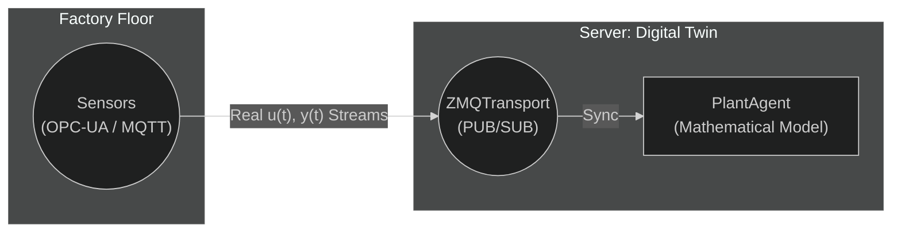

# Advanced Uses — Digital Twins & Arbitrary Signals

The combination of a clean numerical core and a decoupled transport layer positions Synapsys not just as an educational simulation tool, but as a robust foundation for modern industrial and research applications. 

---

## 1. Digital Twins

A **Digital Twin** requires maintaining a mathematical simulation in persistent synchronization with a real-world physical asset. 

By utilizing the multi-agent transport layer, a `PlantAgent` can run forever on a local server, subscribing to the exact physical telemetry data streaming out of your industrial hardware.



By continuously evaluating the virtual state matrix (`x_virtual`) using the exact physical input signals `u(t)` received from the hardware, engineers can compare the mathematical `.evolve(x, u)` output with the real physical sensor data. **Divergence** between the two implies that the physical plant has changed—a common indicator of mechanical wear, unpredicted friction buildup, or imminent system faults.

---

## 2. Real-Time Plotting and Oscilloscopes

If you plot simulation data using `matplotlib` within the exact same loop that computes your control laws, the GUI rendering time will block the control thread, causing immense lag and destroying your physics simulation.

Synapsys's agent separation solves this trivially: you just connect a **third independent process** to the active bus as a read-only "Monitor".

```python
import time
from synapsys.transport import SharedMemoryTransport
# You could launch real-time rendering libraries like PyQtGraph here!

# Attach a read-only handle to the ongoing simulation
monitor = SharedMemoryTransport("ctrl_bus", {"y": 2, "u": 1}, create=False)

try:
    while True:
        y = monitor.read("y")
        u = monitor.read("u")
        
        print(f"Time: {time.time():.4f} | Output: {y} | Input: {u}")
        
        # Run extremely fast async GUI scope updates here
        time.sleep(0.01) 
        
except KeyboardInterrupt:
    pass
```

The `ControllerAgent` and `PlantAgent` processes never know the monitor exists. Their strict microsecond mathematical timings continue performing flawlessly.

---

## 3. Injecting Custom Signals (Ramps, Sines, Time Windows)

Most classical control textbooks only teach the concept of the **Step Response** (`.step()`). In the real world, systems are evaluated against continuous sweeping vibrations, timed duty intervals, and ramp constraints.

### Batch Simulation (NumPy superposition)
Because the core math engine evaluates `u` as an arbitrary array over generic arrays of time `t`, you can compose highly complex test signals using the sheer strength of NumPy:

```python
import numpy as np
from synapsys.api import tf
import matplotlib.pyplot as plt

G = tf([10], [1, 5, 10])

# Time vector (0 to 10 seconds, 1000 uniform points)
t = np.linspace(0, 10, 1000)

# 1. Base Sine Wave (Simulating mechanical vibration)
u_sine = np.sin(2 * np.pi * 1.5 * t)

# 2. Logic Step Injection (Triggers active only after t = 5s)
u_step = np.where(t >= 5, 2.0, 0.0)

# Principle of Superposition: Combine the signals
u_total = u_sine + u_step

# Simulate the LTI plant with the complex signal
t_out, y_out = G.simulate(t, u_total)

plt.plot(t_out, u_total, label="Input u(t) - Sine + Step")
plt.plot(t_out, y_out, label="Output y(t)")
plt.legend()
plt.show()
```

### Real-Time In-Loop Injection
For a live simulation being paced by an agent's tick, you evaluate your custom functions against the elapsed clock continuously on the fly:

```python
import numpy as np
from synapsys.agents import ControllerAgent, SyncEngine, SyncMode

sync = SyncEngine(mode=SyncMode.WALL_CLOCK, dt=0.01)

def ramp_control_law(y: np.ndarray) -> np.ndarray:
    # sync.elapsed = wall-clock seconds since the engine was created
    # sync.t       = simulated time (k * dt) — use this for deterministic signals
    u = 0.5 * sync.elapsed   # linear ramp: +0.5 u per real second
    return np.array([u])

ctrl = ControllerAgent("ramp_ctrl", ramp_control_law, transport, sync)
ctrl.start()
```

Whether you want Brownian noise modeling, sine sweeps for Bode validation, or precise logical time bounds, your test configurations are constrained only by Python's mathematical ecosystem, freeing you from rigid GUI configurators.
