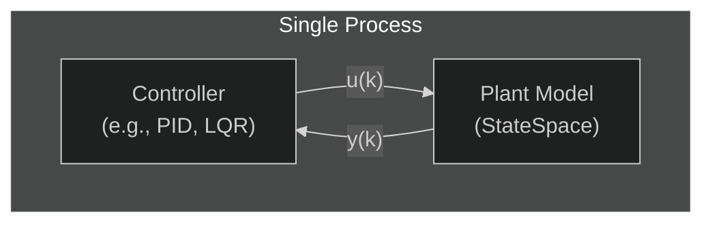
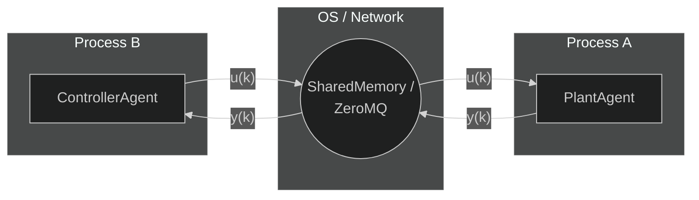
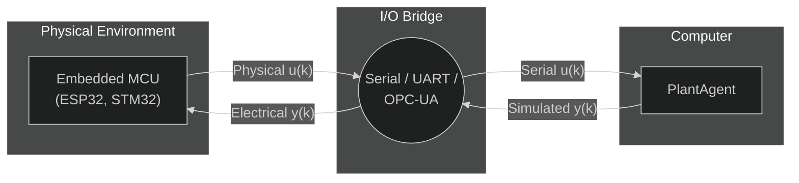
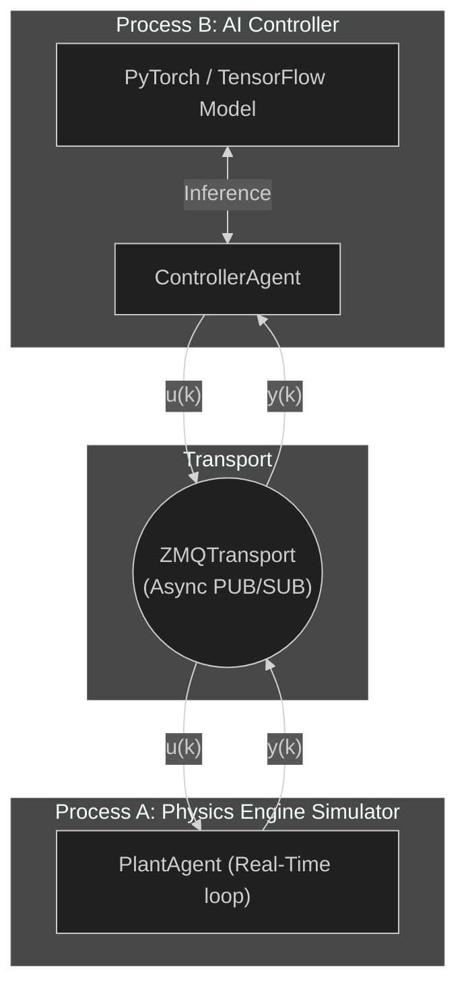

# SIL, HIL & AI Integration

One of the main advantages of Synapsys's agent-based architecture is the seamless transition through different stages of the control system development lifecycle: **MIL**, **SIL**, and **HIL**. 

Because the transport layer is heavily detached from the control algorithms, you can move your controller from a local simulation script to a separate network node, and finally to physical hardware, without altering the control logic itself. This paradigm is especially powerful when validating **Artificial Intelligence (AI)** and **Machine Learning (ML)** models in realistic scenarios.

---

## 1. MIL: Model-in-the-Loop

In **Model-in-the-Loop (MIL)** simulation, both the plant and the controller exist within the same process and simulation thread. Time is advanced artificially by a synchronous `for` loop.



This is the standard approach for early validation, mathematical tuning, and stability proofs.

```python
from synapsys.api import c2d, tf
from synapsys.algorithms import PID
import numpy as np

# Both exist in the same Python script memory
plant = c2d(tf([1], [1, 1]), dt=0.01)
pid = PID(Kp=2.0, Ki=0.5, dt=0.01)

x = np.zeros(plant.n_states)
y = 0.0

# MIL execution
for k in range(100):
    u = pid.compute(setpoint=1.0, measurement=y)
    x, y = plant.evolve(x, u)  # direct method call
```

:::info
**Focus:** Mathematical correctness, algorithm tuning, and continuous-time analysis.

**Limitation:** It assumes zero execution time for the controller and perfect synchrony. It cannot capture operating system latency, network delays, or unpredictable computation jitter.
:::

---

## 2. SIL: Software-in-the-Loop

In **Software-in-the-Loop (SIL)**, the control algorithm runs exactly as it would in deployment, but it executes on a desktop/server (often in a separate process or Docker container) rather than embedded hardware. The plant remains simulated.

To transition from MIL to SIL in Synapsys, you wrap your components into **Agents** and connect them via a `MessageBroker` backed by shared memory or ZeroMQ.



### SIL Implementation

**Terminal 1 (Plant)**
```python
from synapsys.broker import MessageBroker, Topic, SharedMemoryBackend

topic_y = Topic("plant/y", shape=(1,))
topic_u = Topic("plant/u", shape=(1,))

broker = MessageBroker()
broker.declare_topic(topic_y)
broker.declare_topic(topic_u)
broker.add_backend(SharedMemoryBackend("bus", [topic_y, topic_u], create=True))
broker.publish("plant/y", np.zeros(1))
broker.publish("plant/u", np.zeros(1))

plant_agent = PlantAgent(
    "plant", plant_d, None, SyncEngine(),
    channel_y="plant/y", channel_u="plant/u", broker=broker,
)
plant_agent.start(blocking=True)
```

**Terminal 2 (Controller)**
```python
from synapsys.broker import MessageBroker, Topic, SharedMemoryBackend

topic_y = Topic("plant/y", shape=(1,))
topic_u = Topic("plant/u", shape=(1,))

broker = MessageBroker()
broker.declare_topic(topic_y)
broker.declare_topic(topic_u)
broker.add_backend(SharedMemoryBackend("bus", [topic_y, topic_u], create=False))

law = lambda y: np.array([pid.compute(setpoint=1.0, measurement=y[0])])

ctrl_agent = ControllerAgent(
    "ctrl", law, None, SyncEngine(),
    channel_y="plant/y", channel_u="plant/u", broker=broker,
)
ctrl_agent.start(blocking=True)
```

:::tip
**Focus:** Concurrency, transport latency, zero-copy architecture limits, and software integration tests.

**Advantage:** Exposes real-world race conditions and sampling jitter before physical hardware is ever integrated.
:::

---

## 3. HIL: Hardware-in-the-Loop

In **Hardware-in-the-Loop (HIL)**, the control software runs on the **target embedded hardware** (e.g., an ESP32, STM32, or PLC), while the plant is still simulated by Synapsys. 

The physical hardware receives simulated sensor signals and generates physical control actions (like actual PWM or voltage signals) that are fed back into the simulation through a hardware interface bridge.



### HIL Bridge Concept

Instead of instantiating a `ControllerAgent`, you bind the plant's broker to a `HardwareAgent` that bridges the broker bus to a physical device via `synapsys.hw`.

:::warning[Planned feature — v0.5]
Concrete hardware interfaces (`SerialHardwareInterface`, `OPCUAHardwareInterface`, `FPGAHardwareInterface`) are **not yet implemented**. The code below illustrates the intended pattern using the available `MockHardwareInterface`. Replace `MockHardwareInterface` with the appropriate concrete class once v0.5 is released.
:::

```python
from synapsys.hw import MockHardwareInterface   # replace with SerialHardwareInterface in v0.5
from synapsys.agents import HardwareAgent, SyncEngine, SyncMode
from synapsys.broker import MessageBroker, Topic, SharedMemoryBackend
import numpy as np

topic_y = Topic("hw/y", shape=(1,))
topic_u = Topic("hw/u", shape=(1,))

broker = MessageBroker()
broker.declare_topic(topic_y)
broker.declare_topic(topic_u)
broker.add_backend(SharedMemoryBackend("hil_bus", [topic_y, topic_u], create=True))
broker.publish("hw/y", np.zeros(1))
broker.publish("hw/u", np.zeros(1))

# MockHardwareInterface simulates a real device — swap for SerialHardwareInterface later
hw = MockHardwareInterface(n_inputs=1, n_outputs=1)
sync = SyncEngine(SyncMode.WALL_CLOCK, dt=0.01)

agent = HardwareAgent(
    "hw_plant", hw, None, sync,
    channel_y="hw/y", channel_u="hw/u", broker=broker,
)

with hw:
    agent.start(blocking=True)
```

Each tick: reads `y` from hardware → publishes `y` to broker → reads `u` from broker → writes `u` to hardware. On `TimeoutError`, the last known `y`/`u` are held (Zero-Order Hold).

:::note
**Advantage:** You can rigorously test boundary conditions, system failures, and corner cases on the final compiled C/C++ firmware without risking physical damage to an expensive, actual plant (e.g., drones, industrial motors).
:::

---

## 4. Integrating AI and Machine Learning

The classical controls world (PID, LQR) heavily relies on MIL. However, when working with **Reinforcement Learning (RL)**, **Neural Networks**, or complex stochastic models, MIL is often insufficient. AI inference is highly non-deterministic regarding computation time.

Synapsys's decoupled architecture makes it an incredibly robust environment for AI integration.

### The Problem with AI in Control Loops

1. **Inference Time Jitter:** A neural network forward pass (`model(state)`) might take 2ms on one tick, and 15ms on the next due to Python garbage collection, OS scheduling, or GPU transfer limits.
2. **Language Barriers:** AI is predominantly built in Python (PyTorch, TensorFlow, JAX), but traditional HIL environments are heavily C++/Simulink based, requiring complex compilation steps, ONNX exports, or slow middleware.

### The Synapsys Solution

Since Synapsys is **natively Python**, you can run massive, uncompiled PyTorch models directly inside a `ControllerAgent` in a SIL setup.



### Key Advantages for AI Testing

1. **Fault Isolation:** If your PyTorch inference spikes to 100ms, your `PlantAgent` doesn't freeze or crash. It continues running the physical simulation in real-time independently, holding the last known control signal (Zero-Order Hold). This perfectly replicates how a physical system behaves when its smart controller lags.
2. **Gymnasium Wrappers:** You can train your RL agent using standard OpenAI Gym / Gymnasium APIs (which are purely sequential), and then validate the pre-trained weights in a Synapsys SIL environment that introduces real-time constraints, latency, and network drops. This proves if your AI is robust enough for the real world.
3. **Zero-Effort Transition to Reality:** Once your RL agent successfully controls the simulated `PlantAgent` in the SIL environment, you can drop the simulated plant and connect the **exact same PyTorch script** to physical hardware via the HIL bridge. The AI model doesn't know it's now controlling a real motor instead of a matrix array!

### Example: PyTorch RL Agent in a SIL loop

```python
import torch
import numpy as np
from synapsys.agents import ControllerAgent, SyncEngine, SyncMode
from synapsys.broker import MessageBroker, Topic, SharedMemoryBackend

# Load your pre-trained PyTorch model
model = torch.load("rl_controller.pth")
model.eval()

def ai_control_law(y: np.ndarray) -> np.ndarray:
    state_tensor = torch.tensor(y, dtype=torch.float32)
    with torch.no_grad():
        action = model(state_tensor).numpy()
    return action

# Connect to the running broker bus
topic_y = Topic("plant/y", shape=(2,))
topic_u = Topic("plant/u", shape=(1,))

broker = MessageBroker()
broker.declare_topic(topic_y)
broker.declare_topic(topic_u)
broker.add_backend(SharedMemoryBackend("ctrl_bus", [topic_y, topic_u], create=False))

sync = SyncEngine(mode=SyncMode.WALL_CLOCK, dt=0.01)

ai_agent = ControllerAgent(
    "ai_ctrl", ai_control_law, None, sync,
    channel_y="plant/y", channel_u="plant/u", broker=broker,
)
ai_agent.start(blocking=True)
```
