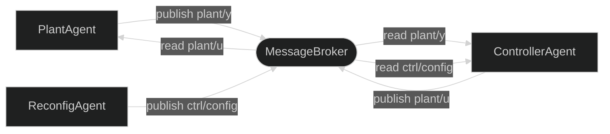
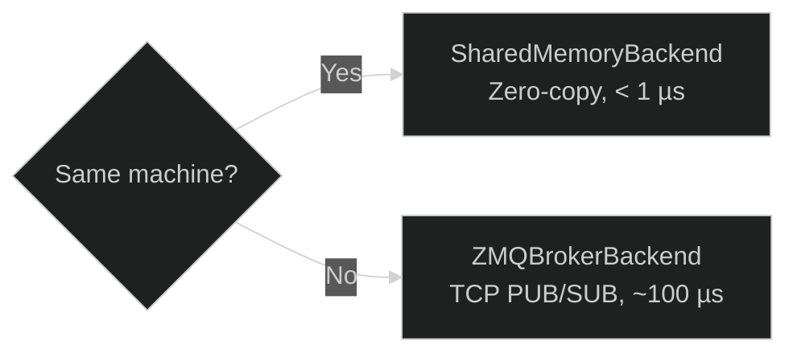

# MessageBroker — Central Routing Layer

The `MessageBroker` is the **recommended** way to wire agents together in Synapsys. It acts as a mediator: agents publish to named `Topic`s and read from them without holding any transport reference directly. This decoupling enables **many-to-many** topologies that are impossible with a single point-to-point transport handle.

---

## Core abstractions

### Topic

A `Topic` describes a named signal: its shape and dtype. It acts as a typed key in the broker registry.

```python
from synapsys.broker import Topic
import numpy as np

topic_y = Topic("plant/y", shape=(4,))          # 4-element float64 vector
topic_u = Topic("plant/u", shape=(1,))
topic_cfg = Topic("ctrl/config", shape=(1,), dtype=np.dtype(np.float32))
```

Topics are **frozen dataclasses** — hashable and immutable. The broker uses them to validate every `publish()` call: if the array shape does not match the declared shape, a `ValueError` is raised before any data is written.

Topic names follow a hierarchical convention: `"<system>/<signal>"`.  
Examples: `"plant/y"`, `"quad/state"`, `"ctrl/config"`.

### BrokerBackend

A `BrokerBackend` is the physical transport underneath the broker. The two built-in backends are:

| Backend | Transport | Best for |
|---|---|---|
| `SharedMemoryBackend` | OS shared memory | Same-machine agents, latency < 1 µs |
| `ZMQBrokerBackend` | ZeroMQ PUB/SUB | Cross-machine agents, async pub/sub |

### MessageBroker

```python
from synapsys.broker import MessageBroker, Topic, SharedMemoryBackend

broker = MessageBroker()
broker.declare_topic(topic_y)
broker.declare_topic(topic_u)
broker.add_backend(SharedMemoryBackend("my_bus", [topic_y, topic_u], create=True))

# Initialise before agents start
broker.publish("plant/y", np.zeros(4))
broker.publish("plant/u", np.zeros(1))
```

| Method | Description |
|---|---|
| `declare_topic(topic)` | Registers a `Topic`. Must be called before `publish` or `read`. |
| `add_backend(backend)` | Attaches a backend. A topic is routed to the first backend that supports it. |
| `publish(name, data)` | Validates shape → writes to backend → notifies callbacks. |
| `read(name)` | Non-blocking read from backend (ZOH if no new data). |
| `subscribe(name, callback)` | Registers a callback invoked on every `publish`. |
| `read_wait(name, timeout)` | Blocking read — waits until new data arrives or timeout. |
| `close()` | Closes all backends and releases resources. |

---

## Wiring agents

Agents accept a `broker=` keyword argument. Pass `None` as the `transport` positional argument when using the broker:

```python
from synapsys.agents import PlantAgent, ControllerAgent, SyncEngine
from synapsys.algorithms import PID

plant_agent = PlantAgent(
    "plant", plant_d, None, SyncEngine(),
    channel_y="plant/y", channel_u="plant/u", broker=broker,
)

pid = PID(Kp=3.0, Ki=0.5, dt=0.01)
ctrl_agent = ControllerAgent(
    "ctrl",
    lambda y: np.array([pid.compute(5.0, y[0])]),
    None, SyncEngine(),
    channel_y="plant/y", channel_u="plant/u", broker=broker,
)

plant_agent.start(blocking=False)
ctrl_agent.start(blocking=True)
```

Both agents share the **same broker instance**. The broker routes `"plant/y"` and `"plant/u"` through the `SharedMemoryBackend` without either agent knowing about shared memory.

---

## Observer pattern

Any code that needs to monitor signals can call `broker.read()` directly — no extra transport handle, no impact on the closed-loop agents:

```python
import time

# Third-party monitor — read-only, completely transparent
try:
    while True:
        y = broker.read("plant/y")
        u = broker.read("plant/u")
        print(f"y={y}  u={u}")
        time.sleep(0.05)
except KeyboardInterrupt:
    broker.close()
```

This is the pattern used by the [Real-Time Scope](../../examples/advanced/realtime-scope) and [Digital Twin](../../examples/advanced/digital-twin) examples.

---

## Multi-agent reconfiguration

Because any number of agents can publish and subscribe to any topic, a `ReconfigAgent` can send live parameter updates to a running controller — something impossible with a single point-to-point transport:



```python
topic_cfg = Topic("ctrl/config", shape=(1,))
broker.declare_topic(topic_cfg)
broker.publish("ctrl/config", np.array([5.0]))   # initial setpoint

# ControllerAgent reads config each tick
def adaptive_law(y: np.ndarray) -> np.ndarray:
    setpoint = broker.read("ctrl/config")[0]
    return np.array([pid.compute(setpoint, y[0])])

# ReconfigAgent publishes a new setpoint at any time
broker.publish("ctrl/config", np.array([10.0]))  # live update
```

---

## Choosing a backend



For cross-machine setups each process creates its **own** broker and connects two `ZMQBrokerBackend` instances (one for PUB topics, one for SUB topics). See [ZeroMQ Transport](zmq.md) for the bidirectional wiring details.

---

## Lifecycle

```python
# Setup
broker = MessageBroker()
broker.declare_topic(topic_y)
broker.add_backend(SharedMemoryBackend("bus", [topic_y], create=True))
broker.publish("plant/y", np.zeros(1))   # initialise before agents start

# Run
agent.start(blocking=True)

# Teardown — always close the broker
broker.close()
```

Calling `broker.close()` closes all registered backends. For `SharedMemoryBackend`, the `create=True` instance also calls `unlink()` to release the OS shared memory block.

---

## API Reference

See the full reference at [synapsys.broker →](../../api/transport#synapsysbroker).
