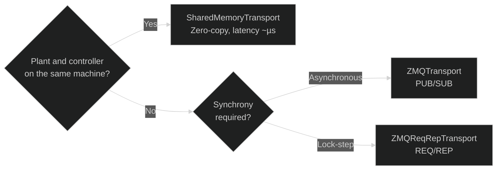

# Transport Layer — Overview

The transport layer abstracts **how data flows** between agents. Every implementation follows the `TransportStrategy` interface:

```python
transport.write("channel", np.array([1.0, 2.0]))
data = transport.read("channel")   # -> np.ndarray
```

## Choosing a transport



| Transport | Typical latency | Topology | Use case |
|---|---|---|---|
| `SharedMemoryTransport` | < 1 µs | same machine | High-frequency simulation |
| `ZMQTransport` (PUB/SUB) | ~100 µs–1 ms | network | Controller on another machine, multiple observers |
| `ZMQReqRepTransport` | ~100 µs–1 ms | network | Lock-step simulation over the network |

## Common interface

```python
from synapsys.transport import SharedMemoryTransport

# Using as a context manager (closes automatically)
with SharedMemoryTransport("bus", {"y": 2, "u": 1}, create=True) as t:
    t.write("y", np.array([0.0, 0.0]))
    y = t.read("y")
```

## Implementing a custom transport

```python
import numpy as np
from synapsys.transport import TransportStrategy

class RedisTransport(TransportStrategy):
    def write(self, channel: str, data: np.ndarray) -> None:
        self._redis.set(channel, data.tobytes())

    def read(self, channel: str) -> np.ndarray:
        raw = self._redis.get(channel)
        return np.frombuffer(raw, dtype=np.float64)

    def close(self) -> None:
        self._redis.close()
```
