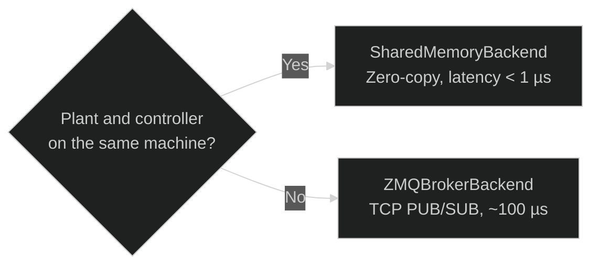

# Transport Layer — Overview

The transport layer abstracts **how data flows** between agents. Synapsys offers two levels of abstraction:

| Level | Interface | When to use |
|---|---|---|
| **High-level** | `MessageBroker` + `Topic` | Recommended for all new code — named, typed channels, multi-agent topologies |
| **Low-level** | `TransportStrategy` | Direct access for custom integrations or legacy code |

---

## Recommended: MessageBroker

The `MessageBroker` is a mediator that routes named `Topic`s through pluggable backends. Agents publish and subscribe to topic names — they never hold transport references directly.

```python
from synapsys.broker import MessageBroker, Topic, SharedMemoryBackend
import numpy as np

topic_y = Topic("plant/y", shape=(1,))
topic_u = Topic("plant/u", shape=(1,))

broker = MessageBroker()
broker.declare_topic(topic_y)
broker.declare_topic(topic_u)
broker.add_backend(SharedMemoryBackend("demo_bus", [topic_y, topic_u], create=True))
broker.publish("plant/y", np.zeros(1))
broker.publish("plant/u", np.zeros(1))
```

See [MessageBroker →](broker.md) for the full guide.

---

## Choosing a transport backend



| Backend | Latency | Topology | Use case |
|---|---|---|---|
| `SharedMemoryBackend` | < 1 µs | Same machine | High-frequency real-time simulation |
| `ZMQBrokerBackend` | ~100 µs–1 ms | Network | Controller on another machine, async pub/sub |
| `ZMQReqRepTransport` *(low-level)* | ~100 µs–1 ms | Network | Lock-step simulation over the network |

---

## Low-level interface (advanced)

`TransportStrategy` is the abstract base for all backends. You can use it directly when you need fine-grained control or are building a custom integration:

```python
import numpy as np
from synapsys.transport import SharedMemoryTransport

# Context manager — releases shared memory automatically on exit
with SharedMemoryTransport("bus", {"y": 2, "u": 1}, create=True) as t:
    t.write("y", np.array([0.0, 0.0]))
    y = t.read("y")
```

### Implementing a custom transport

```python
import numpy as np
from synapsys.transport import TransportStrategy

class RedisTransport(TransportStrategy):
    def write(self, channel: str, data: np.ndarray) -> None:
        self._redis.set(channel, data.tobytes())

    def read(self, channel: str) -> np.ndarray:
        raw = self._redis.get(channel)
        return np.frombuffer(raw, dtype=np.float64)

    def close(self) -> None:
        self._redis.close()
```

To plug a custom transport into the broker layer, wrap it in a `BrokerBackend` subclass — see [`synapsys/broker/backends/base.py`](https://github.com/synapsys-lab/synapsys/tree/main/synapsys/broker/backends/base.py).
