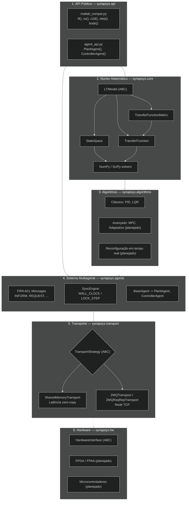

# Arquitetura

O Synapsys é construído em **seis camadas**. Cada camada tem uma única responsabilidade e depende apenas das camadas abaixo. Isso significa que você pode usar o núcleo matemático isoladamente sem tocar na infraestrutura de agentes, ou trocar o transporte sem alterar nenhuma lógica de controle.

## Diagrama de camadas



## Decisões de projeto

### Separação API / Motor matemático

A camada `synapsys.api` é apenas um wrapper de conveniência. Toda a matemática vive em `synapsys.core`. Isso permite que a API evolua sem tocar no núcleo numérico.

### Operator overloading nas classes LTI

`G1 * G2` (série), `G1 + G2` (paralelo) e `G.feedback()` permitem compor sistemas com álgebra de blocos natural:

```python
T = (C * G).feedback()   # malha fechada: C em série com G
```

`TransferFunctionMatrix` estende essa álgebra para plantas MIMO: `*` realiza multiplicação matricial (série) e `+` é elemento a elemento (paralelo). Simulação e análise delegam para uma realização mínima em `StateSpace` construída de forma lazy por `to_state_space()`.

### Padrão Strategy no transporte

`PlantAgent` e `ControllerAgent` não sabem **como** os dados são enviados. Eles chamam `transport.write()` e `transport.read()`. A implementação concreta é injetada na construção — sem mudar lógica de controle.

### Ciclo de vida do transporte

O transporte é **gerenciado pelo chamador**, não pelo agente. O agente nunca chama `transport.close()`. Isso evita double-free quando múltiplos agentes compartilham visões do mesmo bloco de memória.

### Contínuo vs Discreto

`StateSpace(A, B, C, D, dt=0)` é contínuo. `dt > 0` é discreto. O mesmo objeto suporta ambos:

- `is_stable()` usa `Re(poles) < 0` para contínuo e `|poles| < 1` para discreto
- `step()` delega para `scipy.signal.step` ou `scipy.signal.dstep` automaticamente
- `evolve(x, u)` executa `x(k+1) = Ax + Bu` passo a passo para simulação em tempo real
