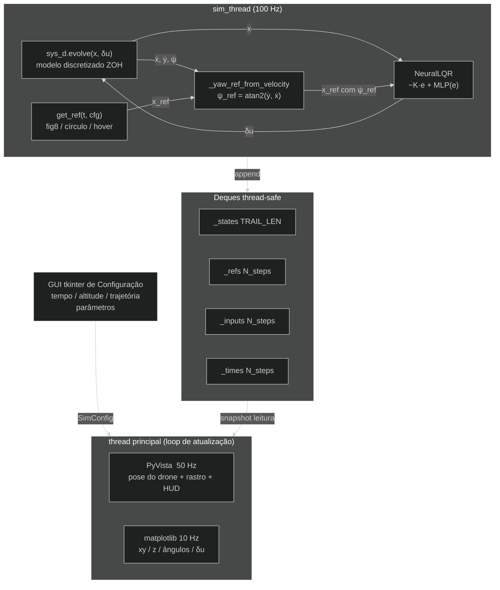

# Quadricóptero MIMO — Controlador Neural-LQR com Animação 3D em Tempo Real

**Arquivos:** `examples/advanced/06_quadcopter_mimo/`

---

## O que este exemplo demonstra

Uma simulação em tempo real completa de um **quadricóptero com 12 estados** controlado por um **Neural-LQR informado pela física** — visualizado simultaneamente em uma cena 3D com PyVista e uma janela de telemetria matplotlib ao vivo. Antes da simulação começar, uma **GUI de configuração em tkinter** permite escolher a trajetória de referência, ajustar seus parâmetros e definir a duração da simulação.

| Conceito | Detalhe |
|---|---|
| **Modelagem LTI MIMO** | Modelo hover linearizado com 12 estados, construído com `synapsys.api.ss()` |
| **LQR MIMO** | `synapsys.algorithms.lqr()` em uma planta 12 estados / 4 entradas |
| **Neural-LQR residual** | `δu = −K·e + MLP(e)` — resíduo zerado na inicialização → começa no LQR ótimo |
| **Yaw alinhado à direção** | O drone rotaciona para apontar na direção do movimento — $\psi_\text{ref} = \text{atan2}(\dot{y}, \dot{x})$ |
| **GUI de configuração** | Dialog tkinter: tempo de simulação, altitude, trajetória de referência e seus parâmetros |
| **PyVista 3D** | Animação da pose do drone + rastro de trajetória a 50 Hz |
| **Telemetria matplotlib** | Rastreamento de posição, ângulos de Euler, entradas de controle — ao vivo a 10 Hz |

---

## Modelo físico — hover linearizado

Um quadricóptero possui dinâmica altamente não-linear, mas na vizinhança do **hover** (velocidade zero, atitude nivelada) uma expansão de Taylor de primeira ordem fornece um modelo **LTI** útil válido para pequenas perturbações (|φ|, |θ| ≤ 15°).

### Vetores de estado e entrada

$$
\mathbf{x} =
\begin{bmatrix}
x & y & z & \varphi & \theta & \psi &
\dot{x} & \dot{y} & \dot{z} & p & q & r
\end{bmatrix}^\top \in \mathbb{R}^{12}
$$

$$
\delta\mathbf{u} =
\begin{bmatrix}
\delta F & \tau_\varphi & \tau_\theta & \tau_\psi
\end{bmatrix}^\top \in \mathbb{R}^{4}
$$

onde $(\varphi, \theta, \psi)$ são rolagem, arfagem e guinada; $(p, q, r)$ são as taxas angulares no corpo; e $\delta\mathbf{u}$ representa **desvios do equilíbrio hover** (em hover $F = mg$).

### Matrizes A e B linearizadas

A equação de estado $\dot{\mathbf{x}} = A\mathbf{x} + B\,\delta\mathbf{u}$ no hover é:

$$
A =
\begin{bmatrix}
0_{3\times 3} & 0_{3\times 3} & I_{3\times 3} & 0_{3\times 3} \\
0_{3\times 3} & 0_{3\times 3} & 0_{3\times 3} & I_{3\times 3} \\
0 & 0 & 0 & g & 0 & 0 & 0_{3\times 6} \\
0 & 0 & 0 & -g & 0 & 0 & 0_{3\times 6} \\
0_{6\times 12}
\end{bmatrix}
$$

Os termos de acoplamento gravitacional são $A_{6,4} = +g$ (aceleração frontal pela arfagem $\theta$) e $A_{7,3} = -g$ (aceleração lateral pela rolagem $\varphi$):

```
ẍ = +g·θ     (arfagem para frente → acelera em x)
ÿ = −g·φ     (rolagem à direita → acelera em −y)
```

A matriz de entrada mapeia cada canal de controle para seu efeito dinâmico:

$$
B =
\begin{bmatrix}
0_{8 \times 4} \\
1/m & 0 & 0 & 0 \\
0 & 1/I_{xx} & 0 & 0 \\
0 & 0 & 1/I_{yy} & 0 \\
0 & 0 & 0 & 1/I_{zz}
\end{bmatrix}
$$

Parâmetros físicos (quadricóptero racing de 500 mm):

| Símbolo | Valor | Significado |
|---|---|---|
| $m$ | 0,500 kg | Massa total |
| $I_{xx} = I_{yy}$ | 4,856 × 10⁻³ kg·m² | Inércia de rolagem / arfagem |
| $I_{zz}$ | 8,801 × 10⁻³ kg·m² | Inércia de guinada |
| $\ell$ | 0,175 m | Braço centro-motor |

O modelo em tempo contínuo é construído com `synapsys.api.ss()` e discretizado a 100 Hz com `synapsys.api.c2d()` pelo método zero-order-hold (ZOH):

```python
from synapsys.api import ss, c2d

A, B, C, D = build_matrices()   # de quadcopter_dynamics.py
sys_c = ss(A, B, C, D)          # sistema LTI em tempo contínuo
sys_d = c2d(sys_c, dt=0.01)     # discretização ZOH a 100 Hz
```

---

## Projeto LQR

O **Regulador Linear Quadrático** minimiza o custo de horizonte infinito:

$$
J = \int_0^\infty \bigl(\mathbf{e}^\top Q\,\mathbf{e} + \delta\mathbf{u}^\top R\,\delta\mathbf{u}\bigr)\,dt
$$

onde $\mathbf{e} = \mathbf{x} - \mathbf{x}_\text{ref}$ é o erro de rastreamento. A matriz de ganho ótima $K$ é encontrada resolvendo a **Equação de Riccati Algébrica** (ARE):

$$
A^\top P + PA - PBR^{-1}B^\top P + Q = 0
\quad\Rightarrow\quad K = R^{-1}B^\top P
$$

Matrizes de peso usadas neste exemplo:

```python
Q = diag([20, 20, 30,    # x, y, z       — erros de posição
           3,  3,  8,    # φ, θ, ψ       — atitude (guinada com mais peso)
           2,  2,  4,    # ẋ, ẏ, ż       — velocidade linear
          0.5, 0.5, 1])  # p, q, r       — taxas angulares

R = diag([0.5, 3.0, 3.0, 5.0])   # δF, τφ, τθ, τψ
```

```python
from synapsys.algorithms import lqr

K, P = lqr(A, B, Q, R)
# K.shape == (4, 12)
# Todos os autovalores em malha fechada têm Re < 0  ✓
```

O $K \in \mathbb{R}^{4 \times 12}$ resultante produz um sistema em **malha fechada** $A - BK$ com todos os autovalores no semiplano esquerdo (Re < 0), confirmando estabilidade assintótica.

---

## Controlador Neural-LQR

### Arquitetura residual

O controlador estende o LQR com um termo residual aprendível:

$$
\delta\mathbf{u} = \underbrace{-K\,\mathbf{e}}_{\text{base LQR}} + \underbrace{\text{MLP}(\mathbf{e})}_{\text{resíduo}}
$$

A MLP tem arquitetura **12 → 64 → 32 → 4** com ativações Tanh. Na inicialização, os **pesos e vieses da camada de saída são zerados**, de modo que a rede começa como LQR puro — o resíduo pode ser treinado depois via RL ou imitação sem alterar nenhuma API.

```python
class NeuralLQR(nn.Module):
    def __init__(self, K_np):
        super().__init__()
        self.register_buffer("K", torch.tensor(K_np, dtype=torch.float32))
        self.residual = nn.Sequential(
            nn.Linear(12, 64), nn.Tanh(),
            nn.Linear(64, 32), nn.Tanh(),
            nn.Linear(32,  4),            # ← zerado na inicialização
        )
        with torch.no_grad():
            nn.init.zeros_(self.residual[4].weight)
            nn.init.zeros_(self.residual[4].bias)

    def forward(self, e):
        return -(e @ self.K.T) + self.residual(e)
```

### Por que esse design?

| Propriedade | Benefício |
|---|---|
| **Estabilidade em t = 0** | A base LQR é provadamente estável; o resíduo não acrescenta nada até ser treinado |
| **Fine-tuning suave** | RL ou IL pode ajustar o resíduo sem desestabilizar o loop |
| **Fallback interpretável** | Remova/zere a MLP → reverte ao LQR ótimo conhecido a qualquer momento |

---

## Trajetórias de referência

Três trajetórias de referência estão disponíveis via GUI de configuração:

### Figura-8 — Lemniscata de Bernoulli

$$
x_\text{ref}(t) = \frac{A\cos(\omega t)}{1 + \sin^2(\omega t)}, \qquad
y_\text{ref}(t) = \frac{A\sin(\omega t)\cos(\omega t)}{1 + \sin^2(\omega t)}, \qquad
z_\text{ref} = z_h
$$

Padrão: $A = 0,8$ m, $\omega = 0,35$ rad/s.

### Círculo

$$
x_\text{ref}(t) = R\cos(\omega t), \qquad
y_\text{ref}(t) = R\sin(\omega t), \qquad
z_\text{ref} = z_h
$$

Padrão: $R = 1,0$ m, $\omega = 0,30$ rad/s.

### Hover (estático)

$$
\mathbf{x}_\text{ref} = [0,\; 0,\; z_h,\; 0, \ldots, 0]^\top
$$

As três trajetórias compartilham a fase de decolagem: o drone sobe do chão até a altitude hover $z_h$ durante os primeiros $t_\text{hover}$ segundos antes de iniciar o rastreamento.

---

## Controle de yaw alinhado à direção

Durante o rastreamento de trajetória, o drone **rotaciona automaticamente para encarar a direção em que está se movendo**. A cada passo de simulação, o yaw desejado é calculado a partir do vetor de velocidade atual:

$$
\psi_\text{ref}(t) = \text{atan2}\!\left(\dot{y}(t),\, \dot{x}(t)\right)
$$

Essa referência é injetada diretamente em `x_ref[5]` antes do cálculo do erro LQR, de modo que a matriz de ganho $K$ existente trata a correção de yaw sem nenhuma mudança estrutural.

Dois casos extremos são tratados explicitamente:

| Condição | Comportamento |
|---|---|
| Velocidade $\|\dot{x}, \dot{y}\| < 0.08$ m/s (próximo ao hover) | Mantém o yaw atual — evita comandos ruidosos quando a velocidade é pouco confiável |
| Erro de yaw cruza $\pm 180°$ | Erro normalizado para $[-\pi, \pi]$ — impede wind-up através da descontinuidade |

```python
def _yaw_ref_from_velocity(vx, vy, psi_current, min_speed=0.08):
    if np.hypot(vx, vy) < min_speed:
        return psi_current      # mantém heading próximo ao hover
    return np.arctan2(vy, vx)

# Dentro do loop de simulação:
x_ref[5] = _yaw_ref_from_velocity(x[6], x[7], x[5])
e = x - x_ref
e[5] = _wrap_angle(e[5])        # normaliza para [-π, π]
```

O resultado é claramente visível na animação 3D: o **nariz do drone sempre aponta na tangente da trajetória** ao percorrer o figura-8 ou o círculo.

---

## Arquitetura



Todos os dados fluem de `sim_thread` para **buffers `collections.deque` thread-safe** protegidos por um único `threading.Lock`. A thread principal lê snapshots sem bloquear a simulação.

---

## GUI de Configuração

Ao iniciar o script, um **dialog tkinter** aparece antes de qualquer janela de simulação:

| Seção | Controles |
|---|---|
| **Tempo de Simulação** | Duração total (s), fase hover de decolagem (s), altitude hover (m) |
| **Trajetória de Referência** | Botões de rádio: Figura-8 / Círculo / Hover |
| **Parâmetros Figura-8** | Slider de amplitude (0,2–2,0 m), velocidade angular (0,1–0,8 rad/s) |
| **Parâmetros Círculo** | Slider de raio (0,2–3,0 m), velocidade angular (0,1–0,8 rad/s) |

Clicar em **Run Simulation** fecha o dialog, valida a configuração e inicia as janelas de simulação e visualização. **Cancel** sai sem executar.

---

## Visualização

### Janela PyVista 3D (50 Hz)


- **Malha do drone** — corpo em configuração X (caixa), 4 braços (cilindros) e 4 rotores (discos); pose atualizada via `actor.user_matrix` a partir da matriz de rotação $R = R_z R_y R_x$ calculada com `scipy.spatial.transform.Rotation`
- **Rastro da trajetória** — últimas `TRAIL_LEN = 500` posições como `pv.PolyData` polyline, atualizado in-place
- **Curva de referência** — prévia estática da trajetória escolhida renderizada no início
- **Overlay HUD** — texto ao vivo mostrando modo, tempo, posição, ângulos de Euler, velocidades

### Janela de telemetria matplotlib (10 Hz)


| Painel | Conteúdo |
|---|---|
| **Superior esquerdo** | Trajetória $x$–$y$ vista de cima vs. curva de referência |
| **Superior direito** | Altitude $z(t)$ vs. linha de referência |
| **Meio** | Ângulos de Euler $\varphi$, $\theta$, $\psi$ em graus |
| **Inferior** | Desvios de controle $\delta F$, $\tau_\varphi$, $\tau_\theta$, $\tau_\psi$ |

Ambas as janelas rodam na **mesma thread principal** usando `pv.Plotter(interactive_update=True)` e `plt.ion()`, evitando crashes de GUI entre threads. A simulação roda em uma thread daemon dedicada.

---

## Como executar

**Instalar dependências:**

```bash
pip install synapsys[viz] torch matplotlib
```

**Executar a simulação standalone:**

```bash
cd examples/advanced/06_quadcopter_mimo
python 06b_neural_lqr_3d.py
```

1. A GUI de configuração tkinter abre — ajuste os parâmetros e clique em **Run Simulation**
2. Uma janela de telemetria matplotlib abre com 4 painéis ao vivo
3. Uma janela PyVista 3D abre com a animação do drone
4. Feche qualquer janela ou pressione **Ctrl+C** para parar

**Exportar GIFs (sem necessidade de display):**

```bash
# Padrão: 20 s, 15 fps 3D + 7 fps telemetria → diretório atual
python 06b_neural_lqr_3d.py --save

# Personalizado: 30 s, fps customizados, pasta de saída
python 06b_neural_lqr_3d.py --save --fps 20 --mpl-fps 8 --out ./resultados
```

Salva `quadcopter_3d.gif` (~1,8 MB) e `quadcopter_telemetry.gif` (~4 MB) em menos de 2 minutos. Requer `pip install imageio`.

**Variante SIL de dois processos (opcional):**

```bash
# Terminal 1 — iniciar a planta linearizada em memória compartilhada
python 06a_quadcopter_plant.py

# Terminal 2 — conectar um controlador externo via SharedMemoryTransport
```

:::tip[Estendendo o Neural-LQR]
A sub-rede `NeuralLQR.residual` (12→64→32→4, Tanh) começa em zero — não faz nada até ser treinada. Substitua os pesos zerados por pesos treinados via PPO, SAC ou DDPG e o restante do exemplo permanece idêntico. As chamadas de API `synapsys` (`ss()`, `c2d()`, `lqr()`, `evolve()`) não mudam.
:::

:::tip[Adicionando feedforward de velocidade]
A referência atual prescreve apenas posição. Para manobras agressivas, adicione um feedforward de velocidade cinematicamente consistente ($\dot{x}_\text{ref}$, $\dot{y}_\text{ref}$) ao estado de referência — isso reduz significativamente o erro de rastreamento durante a fase figura-8.
:::

:::warning[Limites da linearização]
O modelo hover é válido apenas para $|\varphi|, |\theta| \leq 15°$. Manobras agressivas que ultrapassem esse envelope causarão divergência. Para voo em envelope completo, substitua o modelo LTI por um modelo não-linear (ex.: equações de Euler-Lagrange) e use linearização por realimentação ou NMPC.
:::

---

## Referência de arquivos

| Arquivo | Propósito |
|---|---|
| `quadcopter_dynamics.py` | Constantes físicas, `build_matrices()`, `figure8_ref()`, pesos LQR |
| `06a_quadcopter_plant.py` | Planta SIL de dois processos via `PlantAgent` + `SharedMemoryTransport` |
| `06b_neural_lqr_3d.py` | Simulação standalone: GUI de config, Neural-LQR, PyVista 3D, matplotlib |

### Chamadas chave da API synapsys

| Chamada | O que faz |
|---|---|
| `ss(A, B, C, D)` | Constrói um objeto `StateSpace` em tempo contínuo |
| `c2d(sys_c, dt)` | Discretiza para `StateSpace` discreto ZOH |
| `sys_d.evolve(x, u)` | Atualização de estado de um passo: retorna $(x_{k+1},\, y_k)$ |
| `lqr(A, B, Q, R)` | Resolve a ARE, retorna matriz de ganho $K$ e matriz de custo $P$ |
