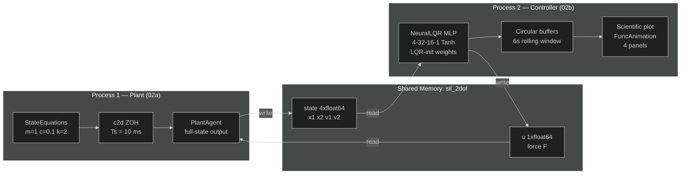

# Software-in-the-Loop with Neural-LQR Controller

**Files:** `examples/advanced/02_sil_ai_controller/`

---

## What this example shows

A two-process **SIL (Software-in-the-Loop)** simulation of a **2-DOF mass-spring-damper** where a **PyTorch MLP** — initialized with LQR optimal gains — drives the physical plant running in a separate process via zero-copy shared memory.

| Process | File | Role |
|---|---|---|
| Plant | `02a_sil_plant.py` | Runs the 2-DOF physics model in real time |
| Controller | `02b_sil_ai_controller.py` | PyTorch Neural-LQR + live scientific plot |

---

## Physical model — 2-DOF mass-spring-damper

```
  [k]         [k]
──/\/\/──[m₁]──/\/\/──[m₂]──→ F(t)
  [c]                  [c]
```

State vector $\mathbf{x} = [x_1,\, x_2,\, \dot{x}_1,\, \dot{x}_2]^\top$ — positions and velocities of both masses. Input: force $F$ applied to $m_2$.

$$
\dot{\mathbf{x}} =
\underbrace{\begin{bmatrix}
0 & 0 & 1 & 0 \\
0 & 0 & 0 & 1 \\
-2k/m & k/m & -c/m & 0 \\
k/m & -2k/m & 0 & -c/m
\end{bmatrix}}_{A}
\mathbf{x}
+
\underbrace{\begin{bmatrix}0\\0\\0\\k/m\end{bmatrix}}_{B}
F
$$

Built with `StateEquations` — no manual index management:

```python
from synapsys.utils import StateEquations

m, c, k = 1.0, 0.1, 2.0

eqs = (
    StateEquations(states=["x1", "x2", "v1", "v2"], inputs=["F"])
    .eq("x1", v1=1)
    .eq("x2", v2=1)
    .eq("v1", x1=-2*k/m, x2=k/m,  v1=-c/m)
    .eq("v2", x1=k/m,  x2=-2*k/m, v2=-c/m, F=k/m)
)
```

---

## Architecture



---

## Neural-LQR controller

### Why LQR initialisation?

LQR solves the infinite-horizon optimal control problem:

$$
\min_{u} \int_0^\infty \left( \mathbf{x}^\top Q\,\mathbf{x} + u^\top R\,u \right) dt
\quad \Rightarrow \quad u^* = -K\mathbf{x} + N_\text{bar}\,r
$$

where $K$ is obtained from the **Algebraic Riccati Equation** and $N_\text{bar}$ is the DC feedforward gain for setpoint tracking.

The MLP is initialised so that its output layer directly implements $u = -K\mathbf{x}$. This:
1. **Guarantees stability at initialisation** — closed-loop poles are analytically placed
2. **Provides a physically meaningful starting point** for RL fine-tuning
3. **Demonstrates physics-informed neural network design** for control applications

```python
from synapsys.algorithms import lqr
import torch.nn as nn

K, _ = lqr(eqs.A, eqs.B,
           Q=np.diag([1.0, 10.0, 0.5, 1.0]),
           R=np.array([[1.0]]))
# K = [−0.382, 2.227, 0.420, 1.747]

class NeuralLQR(nn.Module):
    def __init__(self, K, Nbar):
        super().__init__()
        self.Nbar = Nbar
        self.net = nn.Sequential(
            nn.Linear(4, 32), nn.Tanh(),
            nn.Linear(32, 16), nn.Tanh(),
            nn.Linear(16, 1),
        )
        with torch.no_grad():
            nn.init.xavier_uniform_(self.net[0].weight)
            nn.init.xavier_uniform_(self.net[2].weight)
            # Physics-informed: output layer ← LQR gains
            self.net[4].weight.data = torch.tensor(-K.reshape(1, -1))
            self.net[4].bias.data.zero_()

    def forward(self, x):
        return self.net(x) + self.Nbar * X2_REF
```

### Inference in the control loop

```python
def control_law(state: np.ndarray) -> np.ndarray:
    with torch.no_grad():
        t_in = torch.tensor(state, dtype=torch.float32).unsqueeze(0)
        u = float(model(t_in).squeeze())   # forward pass < 0.1 ms
    return np.clip(np.array([u]), -U_LIMIT, U_LIMIT)
```

```
numpy (4,) → torch.Tensor (1,4) → MLP forward → torch scalar → numpy (1,)
```

`torch.no_grad()` disables autograd — no gradient tracking during inference.

---

## Real-time scientific plot

The agent runs in a **background thread** (`blocking=False`). The main thread drives a 4-panel `FuncAnimation` plot:

| Panel | Signal | Info |
|---|---|---|
| Position (top) | $x_1(t)$, $x_2(t)$ | Tracks setpoint $r = 1.0$ m |
| Velocities (mid-left) | $\dot{x}_1(t)$, $\dot{x}_2(t)$ | Damping dynamics |
| Control force (mid-right) | $F(t)$ | Neural-LQR output, ±20 N saturation |
| Phase portrait (bottom) | $(x_1, x_2)$ trajectory | Convergence to equilibrium |

Data is captured into `collections.deque(maxlen=600)` buffers (6 s window). `deque.append()` is thread-safe under the GIL — no explicit lock needed for reading the animation.

---

## Result


$x_2(t)$ converges to the setpoint $r = 1.0$ m with minimal overshoot. The phase portrait shows the trajectory spiralling into the equilibrium point — the hallmark of an underdamped stable system driven by an optimal controller.

---

## How to run

```bash
# Terminal 1 — start the plant first
uv run python examples/advanced/02_sil_ai_controller/02a_sil_plant.py

# Terminal 2 — connect the Neural-LQR controller
uv run python examples/advanced/02_sil_ai_controller/02b_sil_ai_controller.py
```

A matplotlib window opens with 4 live panels. Close the window to stop.

:::tip[Extending to RL]
Replace the `NeuralLQR` forward pass with any `nn.Module` trained by PPO, SAC or DDPG. The `ControllerAgent` callback signature (`np.ndarray → np.ndarray`) remains identical — only the model weights change.
:::

:::tip[Multi-setpoint tracking]
Change `X2_REF` at runtime, or implement a time-varying reference inside `control_law()`. The MLP's hidden layers can learn non-linear compensation beyond what the linear LQR initialisation provides.
:::
