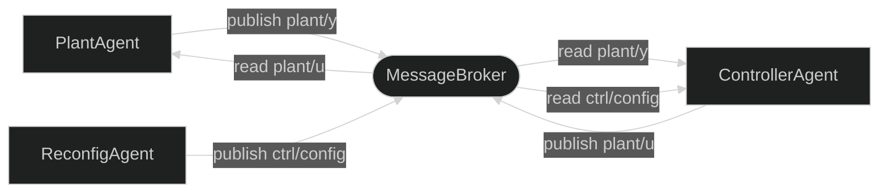
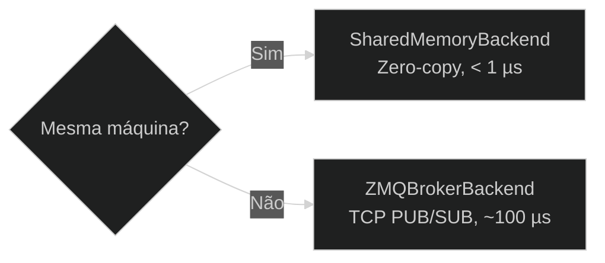

# MessageBroker — Camada Central de Roteamento

O `MessageBroker` é a forma **recomendada** de conectar agentes no Synapsys. Ele atua como mediador: agentes publicam em `Topic`s nomeados e leem deles sem manter nenhuma referência direta ao transporte. Esse desacoplamento permite topologias **many-to-many** impossíveis com um único transporte ponto a ponto.

---

## Abstrações principais

### Topic

Um `Topic` descreve um sinal nomeado: seu shape e dtype. Funciona como uma chave tipada no registro do broker.

```python
from synapsys.broker import Topic
import numpy as np

topic_y = Topic("plant/y", shape=(4,))          # vetor float64 de 4 elementos
topic_u = Topic("plant/u", shape=(1,))
topic_cfg = Topic("ctrl/config", shape=(1,), dtype=np.dtype(np.float32))
```

Topics são **dataclasses imutáveis** — hasháveis e congelados. O broker os usa para validar cada chamada `publish()`: se o shape do array não corresponder ao shape declarado, um `ValueError` é lançado antes de qualquer escrita.

Nomes de topic seguem convenção hierárquica: `"<sistema>/<sinal>"`.  
Exemplos: `"plant/y"`, `"quad/state"`, `"ctrl/config"`.

### BrokerBackend

Um `BrokerBackend` é o transporte físico abaixo do broker. Os dois backends embutidos são:

| Backend | Transporte | Melhor para |
|---|---|---|
| `SharedMemoryBackend` | Memória compartilhada do SO | Agentes na mesma máquina, latência < 1 µs |
| `ZMQBrokerBackend` | ZeroMQ PUB/SUB | Agentes entre máquinas, pub/sub assíncrono |

### MessageBroker

```python
from synapsys.broker import MessageBroker, Topic, SharedMemoryBackend

broker = MessageBroker()
broker.declare_topic(topic_y)
broker.declare_topic(topic_u)
broker.add_backend(SharedMemoryBackend("my_bus", [topic_y, topic_u], create=True))

# Inicializar antes de os agentes iniciarem
broker.publish("plant/y", np.zeros(4))
broker.publish("plant/u", np.zeros(1))
```

| Método | Descrição |
|---|---|
| `declare_topic(topic)` | Registra um `Topic`. Deve ser chamado antes de `publish` ou `read`. |
| `add_backend(backend)` | Anexa um backend. Um topic é roteado ao primeiro backend que o suporta. |
| `publish(name, data)` | Valida shape → escreve no backend → notifica callbacks. |
| `read(name)` | Leitura não-bloqueante do backend (ZOH se não houver dados novos). |
| `subscribe(name, callback)` | Registra callback invocado a cada `publish`. |
| `read_wait(name, timeout)` | Leitura bloqueante — aguarda novos dados ou timeout. |
| `close()` | Fecha todos os backends e libera recursos. |

---

## Conectando agentes

Agentes aceitam o argumento de palavra-chave `broker=`. Passe `None` como argumento posicional `transport` ao usar o broker:

```python
from synapsys.agents import PlantAgent, ControllerAgent, SyncEngine
from synapsys.algorithms import PID

plant_agent = PlantAgent(
    "plant", plant_d, None, SyncEngine(),
    channel_y="plant/y", channel_u="plant/u", broker=broker,
)

pid = PID(Kp=3.0, Ki=0.5, dt=0.01)
ctrl_agent = ControllerAgent(
    "ctrl",
    lambda y: np.array([pid.compute(5.0, y[0])]),
    None, SyncEngine(),
    channel_y="plant/y", channel_u="plant/u", broker=broker,
)

plant_agent.start(blocking=False)
ctrl_agent.start(blocking=True)
```

Ambos os agentes compartilham a **mesma instância do broker**. O broker roteia `"plant/y"` e `"plant/u"` pelo `SharedMemoryBackend` sem que nenhum agente saiba sobre memória compartilhada.

---

## Padrão Observer

Qualquer código que precise monitorar sinais pode chamar `broker.read()` diretamente — sem handle de transporte extra, sem impacto nos agentes em malha fechada:

```python
import time

# Monitor terceiro — somente leitura, completamente transparente
try:
    while True:
        y = broker.read("plant/y")
        u = broker.read("plant/u")
        print(f"y={y}  u={u}")
        time.sleep(0.05)
except KeyboardInterrupt:
    broker.close()
```

---

## Reconfiguração multi-agente

Como qualquer número de agentes pode publicar e assinar qualquer topic, um `ReconfigAgent` pode enviar atualizações de parâmetros ao vivo para um controlador em execução:



```python
topic_cfg = Topic("ctrl/config", shape=(1,))
broker.declare_topic(topic_cfg)
broker.publish("ctrl/config", np.array([5.0]))   # setpoint inicial

def adaptive_law(y: np.ndarray) -> np.ndarray:
    setpoint = broker.read("ctrl/config")[0]
    return np.array([pid.compute(setpoint, y[0])])

# Publica novo setpoint a qualquer momento
broker.publish("ctrl/config", np.array([10.0]))  # atualização ao vivo
```

---

## Escolhendo um backend



Para setups entre máquinas, cada processo cria seu **próprio** broker e conecta duas instâncias de `ZMQBrokerBackend` (uma para topics PUB, uma para SUB). Veja [Transporte ZeroMQ](zmq.md) para detalhes de conexão bidirecional.

---

## Ciclo de vida

```python
# Setup
broker = MessageBroker()
broker.declare_topic(topic_y)
broker.add_backend(SharedMemoryBackend("bus", [topic_y], create=True))
broker.publish("plant/y", np.zeros(1))   # inicializar antes dos agentes

# Execução
agent.start(blocking=True)

# Teardown — sempre feche o broker
broker.close()
```

Chamar `broker.close()` fecha todos os backends registrados. Para `SharedMemoryBackend`, a instância com `create=True` também chama `unlink()` para liberar o bloco de memória compartilhada do SO.

---

## Referência da API

Veja a referência completa em [synapsys.broker →](../../api/transport).
