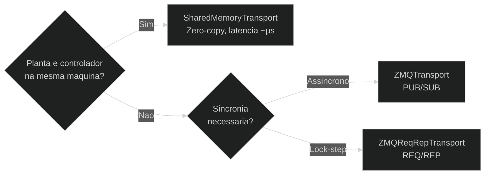

# Camada de Transporte — Visao Geral

A camada de transporte abstrai **como os dados fluem** entre agentes. Toda implementação segue a interface `TransportStrategy`:

```python
transport.write("canal", np.array([1.0, 2.0]))
data = transport.read("canal")   # -> np.ndarray
```

## Escolhendo o transporte



| Transporte | Latência tipica | Topologia | Caso de uso |
|---|---|---|---|
| `SharedMemoryTransport` | < 1 µs | mesma máquina | Simulação de alta frequência |
| `ZMQTransport` (PUB/SUB) | ~100 µs–1 ms | rede | Controlador em outra máquina, múltiplos observadores |
| `ZMQReqRepTransport` | ~100 µs–1 ms | rede | Simulação lock-step sobre rede |

## Interface comum

```python
from synapsys.transport import SharedMemoryTransport

with SharedMemoryTransport("bus", {"y": 2, "u": 1}, create=True) as t:
    t.write("y", np.array([0.0, 0.0]))
    y = t.read("y")
```

## Implementando um transporte customizado

```python
import numpy as np
from synapsys.transport import TransportStrategy

class RedisTransport(TransportStrategy):
    def write(self, channel: str, data: np.ndarray) -> None:
        self._redis.set(channel, data.tobytes())

    def read(self, channel: str) -> np.ndarray:
        raw = self._redis.get(channel)
        return np.frombuffer(raw, dtype=np.float64)

    def close(self) -> None:
        self._redis.close()
```
